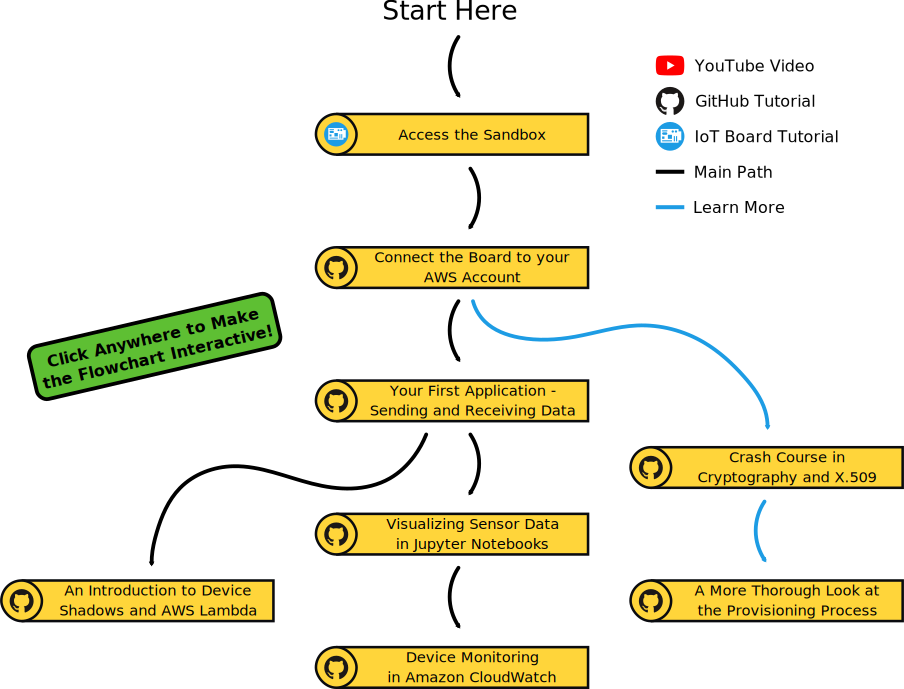

# Microchip IoT Developer Guides for AWS

**Microchip IoT Developer Guides for AWS** is a set of tutorials tailored to get started with your IoT Design, from embedded to cloud. Starting with the [sandbox](./access-the-sandbox), you can play around with sending and receiving data to the cloud with almost no setup. When you are ready, securely [connect the node to your own AWS account](./connect-the-board-to-your-aws-account) and explore an [example application](./your-first-application-sending-and-receiving-data). All the tutorials, and the recommended reading path, can be seen in the [Map of Resources](#map-of-resources).

These tutorials use the  [AVR-IoT WA](https://www.microchip.com/DevelopmentTools/ProductDetails/ev15r70a?utm_campaign=IoT-WA-DevBoards&utm_source=GitHub&utm_medium=hyperlink&utm_term=&utm_content=microchip-iot-developer-guide-for-aws-main-intro
) and [PIC-IoT WA](https://www.microchip.com/DevelopmentTools/ProductDetails/ev54y39a?utm_campaign=IoT-WA-DevBoards&utm_source=GitHub&utm_medium=hyperlink&utm_term=&utm_content=microchip-iot-developer-guide-for-aws-main-intro
) Boards, although the discussed concept are applicable to most IoT Designs.

**If you have an [AVR-IoT WG](https://www.microchip.com/DevelopmentTools/ProductDetails/ac164160?utm_campaign=IoT-WA-DevBoards&utm_source=GitHub&utm_medium=hyperlink&utm_term=&utm_content=microchip-iot-developer-guide-for-aws-main-intro
) or [PIC-IoT WG](https://www.microchip.com/DevelopmentTools/ProductDetails/ac164164?utm_campaign=IoT-WA-DevBoards&utm_source=GitHub&utm_medium=hyperlink&utm_term=&utm_content=microchip-iot-developer-guide-for-aws-main-intro
) board, convert it to the AWS variant (WA) by following the instructions in [this video](https://www.youtube.com/watch?v=nwP8obSRaaE)**

## Map of Resources

## Tutorial List

### [Connect the Board to your AWS Account](./connect-the-board-to-your-aws-account)

An introductory tutorial explaining how to securely connect either a [AVR-IoT WA](https://www.microchip.com/DevelopmentTools/ProductDetails/ev15r70a?utm_campaign=IoT-WA-DevBoards&utm_source=GitHub&utm_medium=hyperlink&utm_term=&utm_content=microchip-iot-developer-guide-for-aws-main-tutorial-list) or [PIC-IoT WA](https://www.microchip.com/DevelopmentTools/ProductDetails/ev54y39a?utm_campaign=IoT-WA-DevBoards&utm_source=GitHub&utm_medium=hyperlink&utm_term=&utm_content=microchip-iot-developer-guide-for-aws-main-tutorial-list) to Amazon Web Services® (AWS) through the AWS IoT Core Module. Introduces the [*IoT Provisioning Tool*](http://www.microchip.com/mymicrochip/filehandler.aspx?ddocname=en1001525), a tool to *provision* the board without the need to know complex cryptography.

### [Your First Application - Sending and Receiving Data](./your-first-application-sending-and-receiving-data)

A tutorial teaching you how to create a *cloud*-based application for the [PIC-IoT](https://www.microchip.com/DevelopmentTools/ProductDetails/ev54y39a?utm_campaign=IoT-WA-DevBoards&utm_source=GitHub&utm_medium=hyperlink&utm_term=&utm_content=microchip-iot-developer-guide-for-aws-main-tutorial-list) and [AVR-IoT](https://www.microchip.com/DevelopmentTools/ProductDetails/ev15r70a?utm_campaign=IoT-WA-DevBoards&utm_source=GitHub&utm_medium=hyperlink&utm_term=&utm_content=microchip-iot-developer-guide-for-aws-main-tutorial-list) Development Boards using [Amazon Web Services®](https://aws.amazon.com/what-is-aws/) and the *MQTT* messaging protocol. You will learn how to communicate with [AWS IoT Core](https://aws.amazon.com/iot-core/) by publishing and subscribing to custom MQTT *topics*, and the tutorial will also cover the embedded side of the application development.

### [Crash Course in Cryptography and X.509](./crash-course-in-cryptography-and-x509)

A crash course in basic public-key cryptography, and their use in the X.509 standard. Discusses the concepts of key-pairs, encryption, signing, certificates, and how to achieve [*confidentiality* and *authenticity*](https://en.wikipedia.org/wiki/Information_security). Recommended for readers who desire a deeper understanding of device provisioning.

### [A More Thorough Look into the Provisioning Process](./a-more-thorough-look-into-the-provisioning-process)

Explores what happens when a board is provisioned through *JITR* (Just In Time Registration) using the [*IoT Provisioning Tool*](http://www.microchip.com/mymicrochip/filehandler.aspx?ddocname=en1001525). JITR is achieved by setting up an AWS Lambda function, which in turn generates an AWS IoT Core Policy and sets up all authentication for the given board. Recommended for readers who desire to understand the details of how devices are authenticated.

### [An Introduction to Device Shadows and AWS Lambda](./an-introduction-to-device-shadows-and-aws-lambda)

A tutorial demonstrating how [Amazon Web Services®](https://aws.amazon.com/what-is-aws/) can be used with the [PIC-IoT](https://www.microchip.com/DevelopmentTools/ProductDetails/ev54y39a?utm_campaign=IoT-WA-DevBoards&utm_source=GitHub&utm_medium=hyperlink&utm_term=&utm_content=microchip-iot-developer-guide-for-aws-main-tutorial-list) and [AVR-IoT](https://www.microchip.com/DevelopmentTools/ProductDetails/ev15r70a?utm_campaign=IoT-WA-DevBoards&utm_source=GitHub&utm_medium=hyperlink&utm_term=&utm_content=microchip-iot-developer-guide-for-aws-main-tutorial-list) Development Boards to perform *serverless cloud computing* and to keep track of *local* state variables using [AWS Lambda](https://aws.amazon.com/lambda/) and the [Device Shadow service](https://docs.aws.amazon.com/iot/latest/developerguide/iot-device-shadows.html) in [AWS IoT Core](https://aws.amazon.com/iot-core/). The tutorial covers important aspects of both embedded and cloud development.

### [Visualizing Sensor Data in Jupyter Notebooks](./visualizing-sensor-data-in-jupyter-notebooks)

A tutorial where sensor data from the [PIC-IoT](https://www.microchip.com/DevelopmentTools/ProductDetails/ev54y39a?utm_campaign=IoT-WA-DevBoards&utm_source=GitHub&utm_medium=hyperlink&utm_term=&utm_content=microchip-iot-developer-guide-for-aws-main-tutorial-list) and [AVR-IoT](https://www.microchip.com/DevelopmentTools/ProductDetails/ev15r70a?utm_campaign=IoT-WA-DevBoards&utm_source=GitHub&utm_medium=hyperlink&utm_term=&utm_content=microchip-iot-developer-guide-for-aws-main-tutorial-list) Development boards are used to construct *data sets* that can be visualized using the *Jupyter Notebook* environment in [Amazon Web Services®](https://aws.amazon.com/what-is-aws/). The tutorial covers configuration of a wide range of services, such as [AWS IoT Core](https://aws.amazon.com/iot-core/), [AWS Lambda](https://aws.amazon.com/lambda/), [AWS IoT Analytics](https://aws.amazon.com/iot-analytics/) and [Amazon Sagemaker](https://aws.amazon.com/sagemaker/) - providing a flexible platform for data exploration.

### [Device Monitoring in Amazon CloudWatch](./device-monitoring-in-amazon-cloudWatch)

A tutorial showcasing how sensor data from the [PIC-IoT](https://www.microchip.com/DevelopmentTools/ProductDetails/ev54y39a?utm_campaign=IoT-WA-DevBoards&utm_source=GitHub&utm_medium=hyperlink&utm_term=&utm_content=microchip-iot-developer-guide-for-aws-main-tutorial-list) and [AVR-IoT](https://www.microchip.com/DevelopmentTools/ProductDetails/ev15r70a?utm_campaign=IoT-WA-DevBoards&utm_source=GitHub&utm_medium=hyperlink&utm_term=&utm_content=microchip-iot-developer-guide-for-aws-main-tutorial-list) Development Boards can be visualized in near *real-time* with [Amazon Web Services®](https://aws.amazon.com/what-is-aws/). [AWS IoT Core](https://aws.amazon.com/iot-core/) and [AWS Lambda](https://aws.amazon.com/lambda/) are used to route the sensor data to [Amazon CloudWatch](https://aws.amazon.com/cloudwatch/), where it is used to generate a continuously updating plot of the temperature and light level measured by the device.

### Designing for Scale! - Simulating an IoT Network

***Coming Soon***
