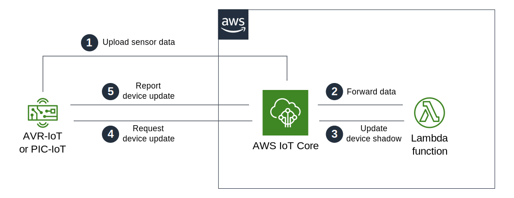
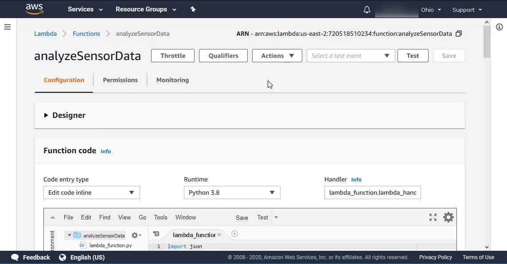
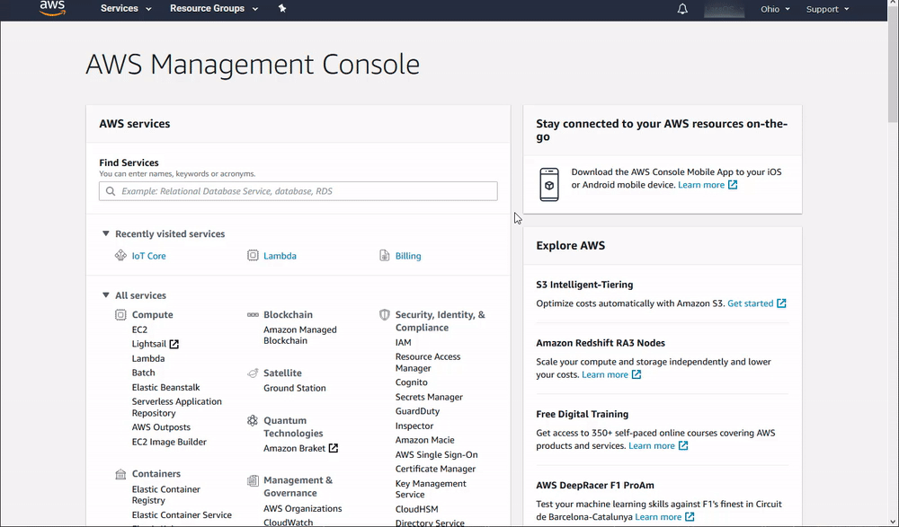

# An Introduction to Device Shadows and AWS Lambda

*Author: Lars Olav Skrebergene, Microchip Technology Inc.*

## Introduction

In this tutorial, we will introduce two new concepts:

- The Device Shadow service in AWS IoT Core
- The AWS Lambda service

We will explain the basic principles of each of these services and walk you through an example application where AWS Lambda is used to analyze light sensor data from [AVR-IoT](https://www.microchip.com/DevelopmentTools/ProductDetails/ev15r70a?utm_campaign=IoT-WA-DevBoards&utm_source=GitHub&utm_medium=hyperlink&utm_term=&utm_content=microchip-iot-developer-guide-for-aws-intro-to-devshadow-lambda) and/or [PIC-IoT](https://www.microchip.com/DevelopmentTools/ProductDetails/ev54y39a?utm_campaign=IoT-WA-DevBoards&utm_source=GitHub&utm_medium=hyperlink&utm_term=&utm_content=microchip-iot-developer-guide-for-aws-intro-to-devshadow-lambda) Development Board(s). If the reported light level is above some threshold, the Device Shadow service will be used to notify a specific IoT board, which will then blink its LEDs.

### Prerequisites

It is assumed that the reader has already provisioned their PIC-IoT and/or AVR-IoT Development Board(s) to communicate with their AWS account, as described in the previous tutorial: [Connecting to AWS with the IoT Provisioning Tool](../connect-the-board-to-your-aws-account).

Before starting this tutorial, make sure that your IoT device(s) are successfully sending sensor data to AWS IoT Core. It is also assumed that the reader has installed the [MPLAB® X IDE](https://www.microchip.com/mplab/mplab-x-ide?utm_campaign=IoT-WA-DevBoards&utm_source=GitHub&utm_medium=hyperlink&utm_term=&utm_content=microchip-iot-developer-guide-for-aws-intro-to-devshadow-lambda) and the [XC8](https://www.microchip.com/mplab/compilers?utm_campaign=IoT-WA-DevBoards&utm_source=GitHub&utm_medium=hyperlink&utm_term=&utm_content=microchip-iot-developer-guide-for-aws-intro-to-devshadow-lambda) (AVR-IoT) or [XC16](https://www.microchip.com/mplab/compilers?utm_campaign=IoT-WA-DevBoards&utm_source=GitHub&utm_medium=hyperlink&utm_term=&utm_content=microchip-iot-developer-guide-for-aws-intro-to-devshadow-lambda) (PIC-IoT) compiler.

Links to software and other useful tools and guides are provided in the [Resources](#resources) section at the end of this tutorial.

## Table of Contents

- [An Introduction to Device Shadows and AWS Lambda](#an-introduction-to-device-shadows-and-aws-lambda)
  - [Introduction](#introduction)
    - [Prerequisites](#prerequisites)
  - [Table of Contents](#table-of-contents)
  - [The AWS Lambda service](#the-aws-lambda-service)
  - [The Device Shadow service in AWS IoT Core](#the-device-shadow-service-in-aws-iot-core)
  - [A Brief Introduction to the firmware of the IoT boards](#a-brief-introduction-to-the-firmware-of-the-iot-boards)
  - [Implementing the Example Application](#implementing-the-example-application)
    - [Step 1: Creating a Role in AWS IAM](#step-1-creating-a-role-in-aws-iam)
    - [Step 2: Designing an AWS Lambda function](#step-2-designing-an-aws-lambda-function)
      - [Step 2.1: Creating an empty Lambda function](#step-21-creating-an-empty-lambda-function)
      - [Step 2.2: Triggering the Lambda function for relevant MQTT packages](#step-22-triggering-the-lambda-function-for-relevant-mqtt-packages)
      - [Step 2.3: Implementing the Lambda function](#step-23-implementing-the-lambda-function)
      - [Step 2.4: Verifying that the Lambda function works as expected](#step-24-verifying-that-the-lambda-function-works-as-expected)
    - [Step 3: Handle device shadow updates](#step-3-handle-device-shadow-updates)
      - [Step 3.1: Start with an unmodified version of the GitHub project](#step-31-start-with-an-unmodified-version-of-the-github-project)
      - [Step 3.3: Add code to handle updates to the device shadow](#step-33-add-code-to-handle-updates-to-the-device-shadow)
  - [Next Steps](#next-steps)
  - [Resources](#resources)

## The AWS Lambda service

AWS Lambda is a service that enables code to be run in the cloud without worrying about things like provisioning, server management, and scalability. It natively supports many different programming languages, and interfaces with a wide range of other AWS services to facilitate cloud development.

In this tutorial, we will use AWS Lambda to perform a simple analysis of light sensor data from AVR-IoT and PIC-IoT Development Board(s). We will keep things simple and only determine whether or not the reported light level is above some threshold value. The main concept that we will focus on is how to route data between AWS Lambda and AWS IoT Core.

To learn more about AWS Lambda and its capabilities, check out the [AWS Lambda Developer Guide](https://docs.aws.amazon.com/lambda/latest/dg/welcome.html) from Amazon.

## The Device Shadow service in AWS IoT Core

Whenever a device (or *thing*) is registered in AWS IoT Core, a [JSON](https://en.wikipedia.org/wiki/JSON) document is created that keeps track of the state of this device. This JSON document is called the *Device Shadow* and can be updated both by the device itself and by other services in AWS.

The Device Shadow could contain pretty much anything, as long as it is compatible with the JSON format. In the example application, that we will implement shortly, we will simply use the Device Shadow to keep track of a variable that determines whether or not the device should blink its LEDs.

State updates published to a device's shadow are classified as either *reported* when they come from the device itself or *desired* if they come from any other source. The Device Shadow service keeps track of both the reported and desired state simultaneously and notifies the device if there are differences between them. It will keep trying to notify the device until the device acknowledges the update and reports that its local state has been changed to be equal to the desired state.

A big advantage of the Device Shadow service is that we can request an update of the device's local state even when it is not connected to the cloud or is switched off. The device will receive the update whenever it reconnects to AWS.

To read more about the Device Shadow service in AWS IoT Core, check out Amazon's documentation: [Device shadow service for AWS IoT](https://docs.aws.amazon.com/iot/latest/developerguide/iot-device-shadows.html).

## A Brief Introduction to the firmware of the IoT boards

Now, as a final step before we start implementing our example application, let us take a quick look at the firmware of the IoT boards.

The firmware that is pre-loaded onto the PIC-IoT and AVR-IoT Development Boards is available on GitHub and will form the starting point for our example application. The MPLAB X projects for the different microcontroller families can be found here:

- [GitHub repository for the **PIC**-IoT Development Boards](https://github.com/microchip-pic-avr-solutions/pic-iot-aws-sensor-node)
- [GitHub repository for the **AVR**-IoT Development Boards](https://github.com/microchip-pic-avr-solutions/avr-iot-aws-sensor-node-mplab)

The `PICIoT.X` and `AVRIoT.X` projects contain many different files that handle cryptography, Wi-Fi connectivity, MQTT communication, and so on. In this tutorial, we will primarily work with `application_manager.c`, which is located under `Source Files -> MCC Generated Files` in MPLAB X. This file contains a lot of useful high-level functions that make it easy to develop an AWS application.

Here is a summary of some important functions in `application_manager.c` that is relevant for this tutorial:

- `subscribeToCloud`
  - Defines which MQTT topics the IoT board should be subscribed to and which functions should be run when messages are received to these topics. In the unmodified `PICIoT.X` and `AVRIoT.X` projects, the board is subscribed to its device shadow update MQTT topic, and `receivedFromCloud` is the function specified to handle such updates.
- `receivedFromCloud`
  - Runs when an MQTT shadow update message is received in the unmodified `PICIoT.X` or `AVRIoT.X` projects. This function analyzes the message and performs some action based on its contents. It then calls the `updateDeviceShadow` function to acknowledge that the shadow update has been received.
- `sendToCloud`
  - Called every second to send sensor data to the cloud as MQTT messages
- `updateDeviceShadow`
  - Similarly to the `sendToCloud` function, this function also sends an MQTT message to the cloud. Instead of sending sensor data, it sends an update to the AWS Device Shadow Service with its current state

We recommend the reader to take a quick look at `application_manager.c`, and, in particular, these functions, to get an overview of the existing functionality.

## Implementing the Example Application

The GitHub projects for the AVR-IoT and PIC-IoT boards are already configured to send temperature and light sensor data to the cloud each second on the `thingName/sensors` MQTT topic, where `thingName` is a unique device identifier in AWS.

In this example, we will analyze such sensor data using [AWS Lambda](https://aws.amazon.com/lambda/) and provide updates to a single monitoring device using the [Device Shadow Service](https://docs.aws.amazon.com/iot/latest/developerguide/iot-device-shadows.html) in AWS IoT Core. The goal is to make the monitoring device blink its LEDs if any of the connected devices are moved from a dark area to an area with a lot of light. A simplified schematic of the example application is provided below, and here is a more detailed description of the different steps:

1. Sensor data is sent from all connected devices to the AWS Cloud as MQTT messages. The MQTT topic is `thingName/sensors`, where `thingName` is the unique identifier for each connected device in the AWS cloud.
2. The data is forwarded from AWS IoT Core to AWS Lambda, where it is analyzed. Data selection is done using an AWS IoT Rule and is passed as parameters to a Lambda function.
3. After AWS Lambda has analyzed the data, the monitoring device's Device Shadow is updated to reflect the desired state of the IoT Board.
4. AWS IoT Core informs the IoT Board of the change to its desired state and awaits updates.
5. The device updates its local state to reflect this desired state and sends a message to AWS IoT Core to report that its local state has been changed.



### Step 1: Creating a Role in AWS IAM

Before we create our Lambda function we should define a *role* in AWS Identity and Access Management (IAM) that defines which services our Lambda functions should be allowed to interact with and which permissions they should have:

1. Sign in to the **AWS Management Console** and select the **IAM** service.
2. Select **Roles** under **Access Management** in the menu on the left-hand side
3. Click **Create role**.
4. Select **AWS service** as the trusted entity.
5. Select **Lambda** as the use case.
6. Click **Next: Permissions**.
7. Attach the **AWSIoTDataAccess** and **AWSLambdaBasicExecutionRole** permission policies by using the search bar and ticking the relevant boxes. This will allow our Lambda function to send data to the AWS IoT Core and use Amazon CloudWatch logs. We will not cover Amazon CloudWatch in this tutorial, but it could be a useful tool for debugging your application later on.
8. Click **Next: Tags**.
9. Click **Next: Review**.
10. Enter `Lambda_IoT_role` as the **Role name**.
11. Click **Create role**


> It is, in general, good practive to use roles to control the access and permissions of various AWS services. It is also good practice to only grant services the permissions they need to function. Check out [Roles Terms and Concepts](https://docs.aws.amazon.com/IAM/latest/UserGuide/id_roles_terms-and-concepts.html) to learn more about roles in AWS and [IAM Best Practices](https://docs.aws.amazon.com/IAM/latest/UserGuide/best-practices.html) to learn how to best secure your AWS resources.

### Step 2: Designing an AWS Lambda function

#### Step 2.1: Creating an empty Lambda function

*AWS Lambda* is a service that enables us to run code in the cloud without worrying about server management. It can be set up to send and receive data from many different services, such as AWS IoT Core, which we will make use of in this tutorial. To create an AWS Lambda function:

1. Sign in to the **AWS Management Console** and select the **Lambda** service.
2. Select **Functions** in the menu on the left-hand side.
3. Click on **Create function**.
4. Choose **Author from scratch**.
5. Enter `analyzeSensorData` as the **Function name**.
6. Select `Python 3.8` as the **Runtime**.
7. Expand **Choose or create an execution role** under **Permissions** and select **Use an existing role**.
8. Select the **Lambda_IoT_role** that we defined in **Step 1** above.
9. Click on **Create function**.


When the AWS Lambda function has been successfully created, the user should be redirected to the Configuration page for the `analyzeSensorData` function. This page can also be found by selecting **Functions** in the menu on the left-hand side in AWS Lambda and then selecting the function from the list.

#### Step 2.2: Triggering the Lambda function for relevant MQTT packages

The next step is to configure the Lambda function to trigger when messages containing sensor data are published over MQTT in AWS IoT Core:

1. On the Lambda function's configuration page, expand the **Designer** panel.
2. Click on **Add trigger**.
3. Select **AWS IoT** as the trigger in the dropdown menu.
4. Select **Custom IoT rule**.
5. In the **Rule** dropdown, select **Create new rule**.
6. Enter `RouteSensorData` as the **Rule name**.
7. Enter `SELECT *, topic() AS topic FROM '+/sensors'` as the **Rule query statement**.
8. Make sure that the **Enable trigger** checkbox is ticked.
9. Click **Add**.



Now, before we move on to writing Python code, let us take a quick look at how the **Rule query** above is constructed. The syntax closely resembles that of *Structured Query Language* (SQL), and the interested reader is encouraged to take a look at Amazon's [AWS IoT SQL Reference](https://docs.aws.amazon.com/iot/latest/developerguide/iot-sql-reference.html) if this seems unfamiliar.

The query finds all messages published to the `+/sensors` MQTT topic, where `+` functions as a wildcard. The PIC-IoT and AVR-IoT Development Boards publish their sensor data to the `ThingName/sensors` topic by default, where `ThingName` here refers to the individual devices' thing names. The `SELECT` statement selects the entire message content using the SQL wildcard symbol `*` and includes the MQTT topic in the message as well using the `topic()` function.

> The wildcard character in SQL is `*`. In an AWS MQTT topic, there are two different wildcard characters: `+` matches any string in the level that contains the character, while `#` matches all strings at or below its level in the topic hierarchy.
>
> \- [AWS Documentation: Topics](https://docs.aws.amazon.com/iot/latest/developerguide/topics.html)

#### Step 2.3: Implementing the Lambda function

1. Ensure that the `analyzeSensorData` function is selected in the **Designer** panel.
2. Paste the following Python code in the editor in the **Function code** panel (this code is also provided as a [lambda_function.py](lambda_function.py) file in this repository):

    ```python
    import boto3 # AWS SDK for python
    import json  # JSON encoder and decoder

    # Name of the AWS IoT Core thing that should be notified about process anomalies
    notificationThing = 'notificationThingName'

    lightLevelThreshold = 200 # Light threshold for process anomaly notification

    # Main function
    def lambda_handler(event, context):
        # Initialize dictionary for state variables
        dict = {}

        if event['Light'] > lightLevelThreshold:
            dict['anomaly'] = 1
        else:
            dict['anomaly'] = 0

        update_shadow(dict, notificationThing)

    # Updates the device shadow of the specified thing_name
    def update_shadow(state_dict, thing_name):

        # Construct payload and convert it to JSON format
        payload = {
            "state": {
                "desired": state_dict
            }
        }
        JSON_payload = json.dumps(payload)

        # Initialize AWS IoT Core SDK communicaiton client
        IoT_client = boto3.client('iot-data', 'us-east-2')

        # Send shadow update request
        response = IoT_client.update_thing_shadow(thingName=thing_name,payload=JSON_payload)
    ```

3. Click **Save**

Now, before we move on, take some time to examine how this code works. Above the editor in the **Function code** panel, there is a text field denoted **Handler**. The function handler defined here dictates which Python function will be executed first when the Lambda function is triggered. AWS Lambda also ensures that the event data routed from AWS IoT Core is passed as the first parameter to this function.

In the `lambda_handler` function, we read the reported light sensor data and check if it is above a set threshold. We then set the state variable `anomaly` based on the result of this check. The `update_shadow` function is then called, which constructs the MQTT payload necessary to request an update of the device's shadow. The interested reader is encouraged to take a look at Amazon's documentation on the Device Shadow service and, in particular, their documentation of [Shadow MQTT Topics](https://docs.aws.amazon.com/iot/latest/developerguide/device-shadow-mqtt.html).

The value of the `notificationThing` variable in the Python code should be updated to the name of the thing that you want to use to receive process anomaly updates. We will implement the handling of such updates later in this tutorial. Make sure that the thing name is written using lowercase letters and remember to click **Save** when the variable has been properly set.

A process *anomaly* will in this tutorial mean that the reported light level of one of the connected devices is above a certain threshold. This `lightLevelThreshold` is set to `200` in the Python code but should be changed to a value that makes it practical to move connected devices into or out of the anomaly light level range for testing purposes.

#### Step 2.4: Verifying that the Lambda function works as expected

To ensure that our Lambda function is working propertly, we can check if the update requests are successfully published to the relevant MQTT topic:

1. Open the **AWS Management Console** and select the **IoT Core** service.
2. Select **Test** in the menu on the left-hand side.
3. Enter `$aws/things/ThingName/shadow/update/#` as the **Subscription topic**, where `ThingName` should be replaced with the same thing name that was used for the `notificationThing` variable above.
4. Click **Subscribe to topic**.



If everything has been set up successfully, you should get a continuous stream of MQTT device shadow update messages, as seen in the illustration above. If not, make sure that you have done everything according to this tutorial and that device sensor data is still being broadcast. The latter can be verified by subscribing to the `+/sensors` topic instead of `$aws/things/ThingName/shadow/update/#` in **IoT Core**.

### Step 3: Handle device shadow updates

#### Step 3.1: Start with an unmodified version of the GitHub project

The starting point for this example is an unmodified copy of the GitHub project compatible with your device's microcontroller family:

- [GitHub repository for the **PIC**-IoT Development Boards](https://github.com/microchip-pic-avr-solutions/pic-iot-aws-sensor-node)
- [GitHub repository for the **AVR**-IoT Development Boards](https://github.com/microchip-pic-avr-solutions/avr-iot-aws-sensor-node-mplab)

Download the correct repository and open the `PICIoT.X` and `AVRIoT.X` project in MPLAB X.

#### Step 3.3: Add code to handle updates to the device shadow

There are quite a few things that should be implemented to be able to update the device shadow and to keep track of the current anomaly status locally. All of the changes described should be implemented in `application_manager.c`:

1. Create a state variable to keep track of the local anomaly state:
   - Add the following line to the top of the file, just below the declaration of the `toggleState` variable:

        ```c
        static uint8_t anomalyState = 0;
        ```

2. Create functions to set and get the value of this variable:
   - Add the following functions beneath the `getToggleState` and `setToggleState` functions that were used in the sandbox examples:
  
        ```c
        static void setAnomalyState(uint8_t passedAnomalyState){
            anomalyState = passedAnomalyState;
        }

        static uint8_t getAnomalyState(void){
            return anomalyState;
        }
        ```

   - Remember to also declare the functions at the top of the file, for example, close to the declarations of `setToggleState` and `getToggleState`:

      ```c
      static void setAnomalyState(uint8_t passedAnomalyState);
      static uint8_t getAnomalyState(void);
      ```

3. Change the `receivedFromCloud` function to include a check for an `anomaly` field in the received MQTT message, and run the `LED_test()` function twice when an anomaly is detected to make all the LEDs blink:
   - Add a variable that contains the JSON-encoded `anomaly` message field:

        ```c
        char *anomalyToken = "\"anomaly\":";
        ```

   - Add an `else if` clause to handle anomaly messages. This should be added at the same nesting level as the check for the `toggleToken` string:

      ```c
      else if ((subString = strstr((char*)payload, anomalyToken)))
        {
            if (subString[strlen(anomalyToken)] == '1')
            {
                setAnomalyState(1);
                LED_test();
                LED_test();
            }
            else
            {
                setAnomalyState(0);
            }
        }
      ```

4. Update the `updateDeviceShadow` function to include the device's current anomaly status.
   - Change the value that the `payloadLength` variable is set to in the first `if` statement to the following:

      ```c
      payloadLength = sprintf(payload,"{\"state\":{\"reported\":{\"toggle\":%d,\"anomaly\":%d}}}", getToggleState(), getAnomalyState());
      ```

5. Build the modified project and program the device in MPLAB X.

If you have multiple PIC-IoT and AVR-IoT boards, you can try to configure them as well in the same way. You do not need to follow the entire tutorial for each board. It is enough to start with [Step 3](#step-3-handle-device-shadow-updates).

At this point, everything should be working as intended. When the device(s) are fully configured, place them all in an area where the light level is below the threshold. Then try to increase the light level for any of the devices by moving them to an area with a higher light level or by shining light on the device(s) using a flashlight. The LEDs on the monitoring device should blink when this light *anomaly* is detected. If you have trouble finding suitably lit areas, adjust the threshold value in the Lambda function, and try again.


This example has showcased how sensor data from many different devices can be sent to, and analyzed by, AWS, and how process updates can be sent to another device by accessing its shadow. Our data analysis has been very basic to better highlight the fundamental concepts of Device Shadow updates. More complex examples can be made by using additional AWS services. At this point, it could be a good exercise to play around with the code and the configuration to adapt the example to your needs, or to continue exploring other tutorials for the PIC-IoT and AVR-IoT boards.

## Next Steps

[](/)

## Resources

- [PIC-IoT WA Development Board Product Page](https://www.microchip.com/DevelopmentTools/ProductDetails/ev54y39a?utm_campaign=IoT-WA-DevBoards&utm_source=GitHub&utm_medium=hyperlink&utm_term=&utm_content=microchip-iot-developer-guide-for-aws-intro-to-devshadow-lambda)
- [AVR-IoT WA Development Board Product Page](https://www.microchip.com/DevelopmentTools/ProductDetails/ev15r70a?utm_campaign=IoT-WA-DevBoards&utm_source=GitHub&utm_medium=hyperlink&utm_term=&utm_content=microchip-iot-developer-guide-for-aws-intro-to-devshadow-lambda)
- [Get Started with MPLAB® X IDE and Microchip Tools](https://microchipdeveloper.com/tls0101:start?utm_campaign=IoT-WA-DevBoards&utm_source=GitHub&utm_medium=hyperlink&utm_term=&utm_content=microchip-iot-developer-guide-for-aws-intro-to-devshadow-lambda)
- [AWS Identity and Access Management User Guide](https://docs.aws.amazon.com/IAM/latest/UserGuide/introduction.html)
  - [IAM Roles](https://docs.aws.amazon.com/IAM/latest/UserGuide/id_roles.html)
- [AWS IoT Developer Guide](https://docs.aws.amazon.com/iot/latest/developerguide/what-is-aws-iot.html)
  - [Device Shadow service for AWS IoT](https://docs.aws.amazon.com/iot/latest/developerguide/iot-device-shadows.html)
  - [AWS IoT SQL Reference](https://docs.aws.amazon.com/iot/latest/developerguide/iot-sql-reference.html)
  - [Rules for AWS IoT](https://docs.aws.amazon.com/iot/latest/developerguide/iot-rules.html)
  - [Topics](https://docs.aws.amazon.com/iot/latest/developerguide/topics.html)
- [AWS Lambda Developer Guide](https://docs.aws.amazon.com/lambda/latest/dg/welcome.html)
- [IoT Provisioning Tool](http://www.microchip.com/mymicrochip/filehandler.aspx?ddocname=en1001525)
- GitHub repositories with the IoT Boards' pre-loaded firmware
  - [For the PIC-IoT Development Boards](https://github.com/microchip-pic-avr-solutions/pic-iot-aws-sensor-node)
  - [For the AVR-IoT Development Boards](https://github.com/microchip-pic-avr-solutions/avr-iot-aws-sensor-node-mplab)
