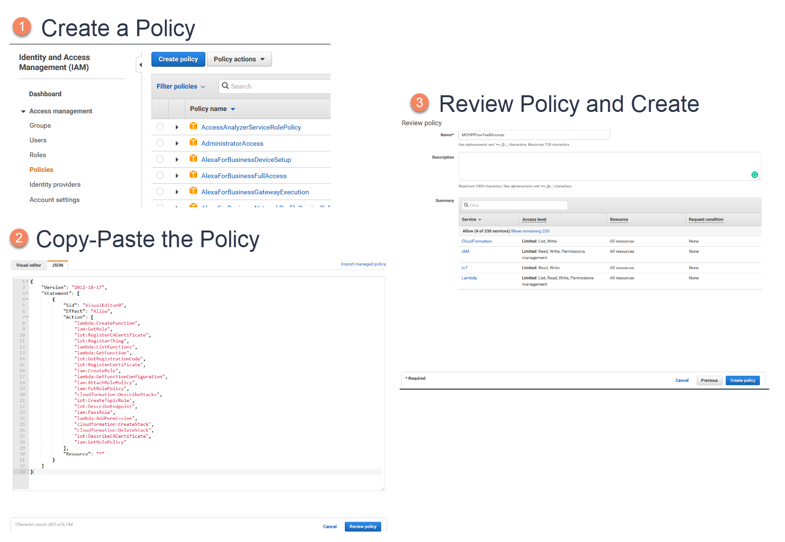
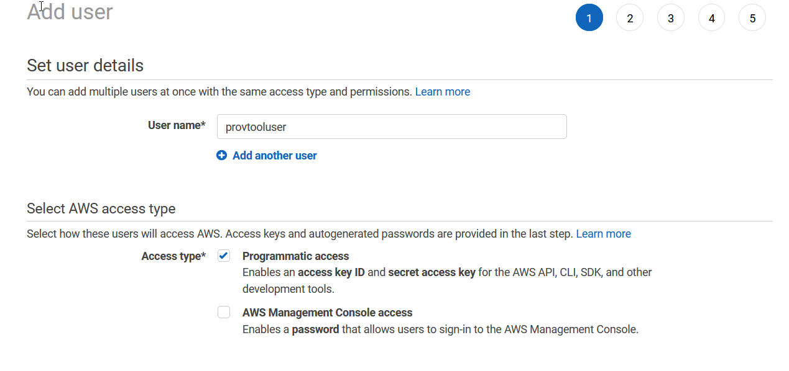
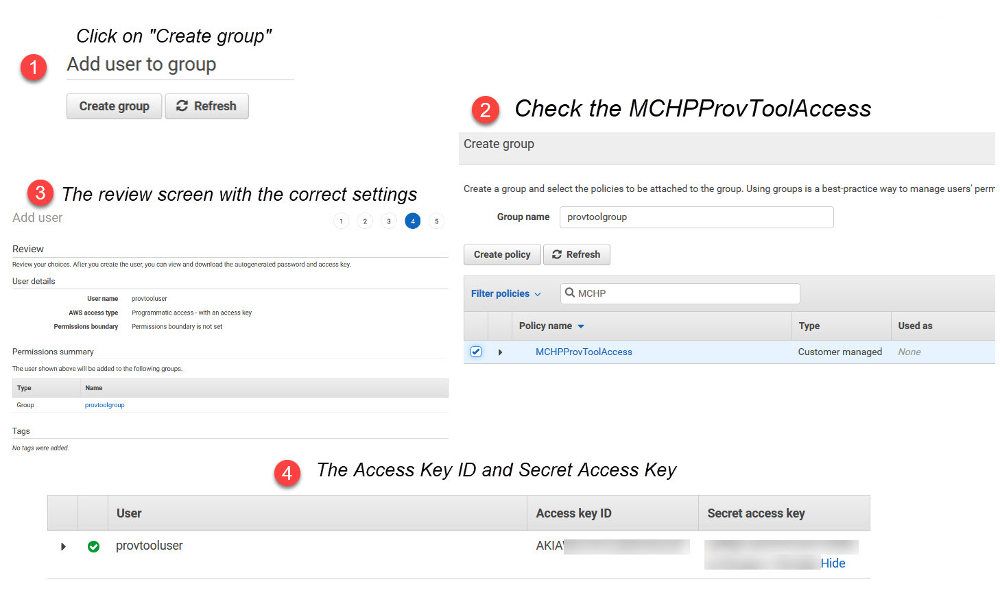
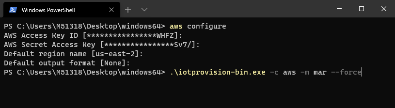
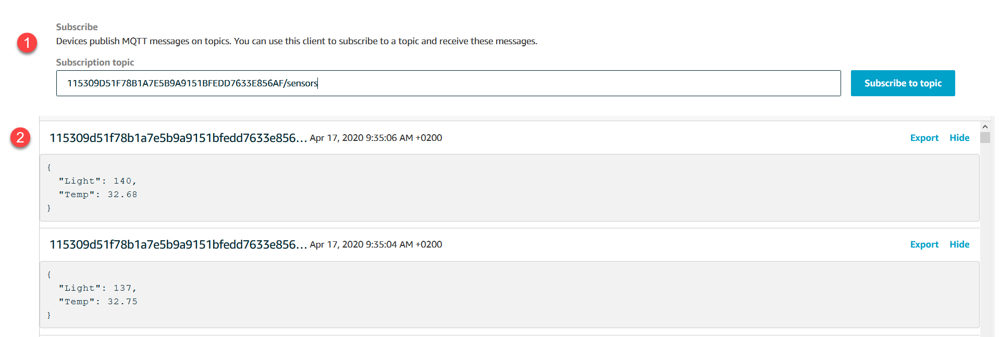

# Connect the Board to your AWS Account

*Author: Johan Lofstad, Microchip Technology Inc.*

## Introduction

This introductory guide explains how to securely connect an embedded design to [Amazon Web Services® (AWS)](https://aws.amazon.com/) through the [AWS IoT Core](https://aws.amazon.com/iot-core/) module. When connected, the AWS API can be used to send and receive data between the cloud and the board.

### Recommended Hardware

This document is primarily written for the [AVR-IoT WA](https://www.microchip.com/DevelopmentTools/ProductDetails/ev15r70a?utm_campaign=IoT-WA-DevBoards&utm_source=GitHub&utm_medium=hyperlink&utm_term=&utm_content=microchip-iot-developer-guide-for-aws-connect-board-to-aws), [AVR-IoT WG](https://www.microchip.com/DevelopmentTools/ProductDetails/ac164160?utm_campaign=IoT-WA-DevBoards&utm_source=GitHub&utm_medium=hyperlink&utm_term=&utm_content=microchip-iot-developer-guide-for-aws-connect-board-to-aws), [PIC-IoT WA](https://www.microchip.com/DevelopmentTools/ProductDetails/ev54y39a?utm_campaign=IoT-WA-DevBoards&utm_source=GitHub&utm_medium=hyperlink&utm_term=&utm_content=microchip-iot-developer-guide-for-aws-connect-board-to-aws), and [PIC-IoT WG](https://www.microchip.com/DevelopmentTools/ProductDetails/ac164164?utm_campaign=IoT-WA-DevBoards&utm_source=GitHub&utm_medium=hyperlink&utm_term=&utm_content=microchip-iot-developer-guide-for-aws-connect-board-to-aws) development boards. Users with these boards can follow the guide on a step-by-step basis. Users of AVR-IoT and PIC-IoT are recommended to run the quick start first to connect the board to the internet and explore the cloud sandbox before continuing. Instructions can be found at the ["See it in Action"](../access-the-sandbox) page.

### Required Software

The [*IoT Provisioning Tool*](http://www.microchip.com/mymicrochip/filehandler.aspx?ddocname=en1001525) is used to generate and upload the required certificates to AWS and the IoT Board using *Just In Time Registration (JITR)*. For a deeper understanding of the provisioning process, see [Crash Course in Cryptography and X.509](../crash-course-in-cryptography-and-x509) and [A More Thorough Look into the Provisioning Process](../a-more-thorough-look-into-the-provisioning-process) after reading this document.

**This guide explores the following topics:**

- Configure AWS IAM with appropriate permissions

- Using the IoT Provisioning Tool to authenticate the board with AWS IoT Core

- Configure AWS IoT Core to communicate with the board through MQTT

An AWS account is required for this guide. You can obtain one at [aws.amazon.com](https://aws.amazon.com/).

## Table of Contents

- [Connect the Board to your AWS Account](#connect-the-board-to-your-aws-account)
  - [Introduction](#introduction)
    - [Recommended Hardware](#recommended-hardware)
    - [Required Software](#required-software)
  - [Table of Contents](#table-of-contents)
  - [Step 1: Configuring AWS Identity and Access Management (IAM)](#step-1-configuring-aws-identity-and-access-management-iam)
    - [Create a Policy](#create-a-policy)
    - [Creating a New IAM User](#creating-a-new-iam-user)
  - [Step 2: Provisioning of the IoT Board](#step-2-provisioning-of-the-iot-board)
    - [Step 2.1 Install the Provisioning Tool and its Dependencies](#step-21-install-the-provisioning-tool-and-its-dependencies)
    - [Step 2.2 Generate the Certificates](#step-22-generate-the-certificates)
      - [Registering the AWS Credentials](#registering-the-aws-credentials)
      - [Running the IoT Provisioning Tool](#running-the-iot-provisioning-tool)
  - [Step 3: Testing and Receiving the Messages](#step-3-testing-and-receiving-the-messages)
  - [Step 4: Adding Multiple Devices](#step-4-adding-multiple-devices)
  - [Next Steps](#next-steps)
  - [Resources](#resources)

## Step 1: Configuring AWS Identity and Access Management (IAM)

IAM is an AWS service managing who and what has access to different *resources*. A resource is something "existing" in AWS. This could, for instance, be a registered IoT device, a cloud module such as the IoT Core, or a cryptographic certificate. The security philosophy is, *you only have access to a resource if you **need** that resource*.

> *AWS Identity and Access Management (IAM) is a web service that helps you securely control access to AWS resources. You use IAM to control who is authenticated (signed in) and authorized (has permissions) to use resources.*
>
> \- [*AWS IAM Documentation*](https://docs.aws.amazon.com/IAM/latest/UserGuide/introduction.html)

To connect the board to an AWS account, it must be *provisioned* using the [*IoT Provisioning Tool*](http://www.microchip.com/mymicrochip/filehandler.aspx?ddocname=en1001525), which requires specific AWS access to configure the required modules.

### Create a Policy

 Permission for these specific resources is given to the tool through a *policy*. From the AWS Documentation:

> *You manage access in AWS by creating policies and attaching them to IAM identities (users, groups of users, or roles) or AWS resources. A policy is an object in AWS that, when associated with an identity or resource, defines their permissions.*
>
> \- [AWS Documentation - Policies and Permissions](https://docs.aws.amazon.com/IAM/latest/UserGuide/access_policies.html)

Open the [IAM module](https://console.aws.amazon.com/iam/home#/home) in AWS and select **Policies** in the menu on the left-hand side. Click **Create policy** and select the **JSON** tab. Copy and paste the contents of [MCHPProvToolAccess.json](./MCHPProvToolAccess.json) into the editor and click **Review Policy**. Name it `MCHPProvToolAccess` before clicking **Create policy**.



### Creating a New IAM User

With the policy created, it must be attached to a *user*. Navigate to the [IAM module](https://console.aws.amazon.com/iam/home#/home) and click **Users** followed by **Add user**. Give it a suitable name such as `provtooluser`. Check **Programmatic access** as the **Access type**. Click on **Next: Permissions**.



When presented with the **Add user** screen:

1. Click **Create group** and name it `provtoolgroup`.
2. Check the **MCHPProvToolAccess** policy.
3. Click **Create group** in the bottom right corner.

Proceed to click **Next** until the review screen. Review the details and click **Create User**. A set of user credentials is generated. Make note of the **Access key ID** and **Secret access key** (click **Show** to reveal the secret access key).



## Step 2: Provisioning of the IoT Board

> *Provisioning* a device is the process of authenticating it with the cloud.

There are several methods to provision the board with AWS, and the method is dependant on the application. In this guide the *Just In Time Registration* (JITR) approach is used, where the IoT Provisioning tool takes care of the cryptography. This is a good choice to get started with a small number of boards, or when you have many pre-provisioned boards (For instance when buying with [*Microchip TrustFLEX*](https://www.microchip.com/design-centers/security-ics/trust-platform/trustflex?utm_campaign=IoT-WA-DevBoards&utm_source=GitHub&utm_medium=hyperlink&utm_term=&utm_content=microchip-iot-developer-guide-for-aws-connect-board-to-aws)).

### Step 2.1 Install the Provisioning Tool and its Dependencies

- Install the [AWS Command Line Interface](https://aws.amazon.com/cli/)
- Download the [IoT Provisioning Tool](http://ww1.microchip.com/downloads/en/DeviceDoc/iotprovision-1.0.90.zip). Extract the zip folder to a known location.

### Step 2.2 Generate the Certificates

Open a command line (the [Command Prompt](https://en.wikipedia.org/wiki/Cmd.exe) for Windows® and the terminal for Mac® and Linux®) and navigate to the extracted IoT Provisioning Tool folder. Run `aws configure` and enter the fields being asked for. The access credentials are the ones from [the IAM section](#creating-a-new-iam-user). See the screenshot below.

 *Note that the console syntax below might be different for your system.*

#### Registering the AWS Credentials

```console
user@sys:/provtool$ aws configure
AWS Access Key ID [None]: AKIAWDV5V***********
AWS Secret Access Key [None]: *********************
Default region name [None]: us-east-2
Default output format [None]:
```

#### Running the IoT Provisioning Tool

Connect the board through USB to the computer. With the board connected and the AWS credentials set, the provisioning tool can create and upload the certificates.

```console
user@sys:/provtool$ ./iotprovision-bin -c aws -m custom --force
......
......
......
Rebooting debugger
  Done.
```

 

The tool creates and uploads a *Certificate Authority (CA)* to AWS IoT Core, to the region specified in [Registering the AWS Credentials](#registering-the-aws-credentials) section. When the board has managed to connect to AWS, it uploads its certificate, which is signed by the newly created CA. This is the [X.509](https://en.wikipedia.org/wiki/X.509) cryptography standard and is not required reading for this introductory guide. For now, understand that the CA *trusts* the device's certificate. Every device that has a CA trusted certificate can be authorized. For reference, all the certificates and their private keys can be found in the `.microchip-iot` folder in the user home directory.

|OS|Path|
|---|---|
|Windows|%userprofile%\\.microchip-iot|
|Mac and Linux|~/.microchip-iot|

> *In cryptography, a certificate authority or certification authority (CA) is an entity that issues digital certificates. A digital certificate certifies the ownership of a public key by the named subject of the certificate. This allows others (relying parties) to rely upon signatures or on assertions made about the private key that corresponds to the certified public key.*
>
> \- [Wikipedia.org - Certificate Authority](https://en.wikipedia.org/wiki/Certificate_authority)

Make sure the device is connected to the internet, indicated by a solid blue light on the board. See the ["See it in Action"](../access-the-sandbox) page for instructions on connecting to the internet.

If the device blinks a yellow LED, the board is provisioned, and data flows from the board to AWS. The provisioning tool created and uploaded the following items:

- The Certificate Authority (CA) under **Secure -> CAs**

- The board's certificate under **Secure -> Certificates**

- The device (thing) under **Manage -> Things**

> In AWS, a device is called a *thing*, as in Internet of *Things*.

## Step 3: Testing and Receiving the Messages

The board is now provisioned, and data is sent from the board to AWS. This data can be viewed by going to **Test** in [AWS IoT Core](https://aws.amazon.com/iot-core/). Under **Subscription topic**, enter `thingName/sensors`. The `thingName` is a unique identifier for the device. The name is found under **Manage -> Things**. Click **Subscribe to topic**. The data now streams out to the console, as seen in the figure below.

*Potential Pitfall: The thing name must be **lowercase** when subscribing to its sensor topic.*

> The protocol used to send and receive data is [*MQTT*](https://docs.aws.amazon.com/iot/latest/developerguide/mqtt.html). It is recommended to become familiar with MQTT when working with these kinds of IoT devices. By default, the IoT board sends data on the `sensors` topic.



## Step 4: Adding Multiple Devices

Every new device added to AWS IoT must be signed by the Certificate Authority (CA) created in [Step 2.2 Generate the certificates](#step-22-generate-the-certificates). Connect the new board through USB, and run the provisioning tool in the same manner.

```console
user@sys:/provtool$ ./iotprovision-bin -c aws -m custom
......
......
......
Rebooting debugger
  Done.
```

The tool creates a new certificate and signs it with the CA, making the CA *trust* the certificate. When the new device connects to AWS, it is recognized as trusted and automatically added to the list of things. The device's data can be access in the same manner as the first one, on the `thingName/sensors` MQTT topic.

## Next Steps

<p align="middle">
  <a href="../crash-course-in-cryptography-and-x509"></a>
  <a href="../your-first-application-sending-and-receiving-data"> </a>
</p>

## Resources

- [PIC-IoT WA Development Board Product Page](https://www.microchip.com/DevelopmentTools/ProductDetails/ev54y39a?utm_campaign=IoT-WA-DevBoards&utm_source=GitHub&utm_medium=hyperlink&utm_term=&utm_content=microchip-iot-developer-guide-for-aws-connect-board-to-aws)
- [AVR-IoT WA Development Board Product Page](https://www.microchip.com/DevelopmentTools/ProductDetails/ev15r70a?utm_campaign=IoT-WA-DevBoards&utm_source=GitHub&utm_medium=hyperlink&utm_term=&utm_content=microchip-iot-developer-guide-for-aws-connect-board-to-aws)
- [AWS IAM Documentation](https://docs.aws.amazon.com/IAM/latest/UserGuide/introduction.html)
- [AWS IoT Core Documentation](https://docs.aws.amazon.com/iot/latest/developerguide/what-is-aws-iot.html)
- [IoT Provisioning Tool](http://www.microchip.com/mymicrochip/filehandler.aspx?ddocname=en1001525)
- AWS Provisioning Methods
  - JITR using [X.509](https://en.wikipedia.org/wiki/X.509) (This README)
  - [AWS JITR Registration Blog](https://aws.amazon.com/blogs/iot/setting-up-just-in-time-provisioning-with-aws-iot-core/)
  - [AWS Multi Account Registration (MAR)](https://pages.awscloud.com/iot-core-early-registration.html)
