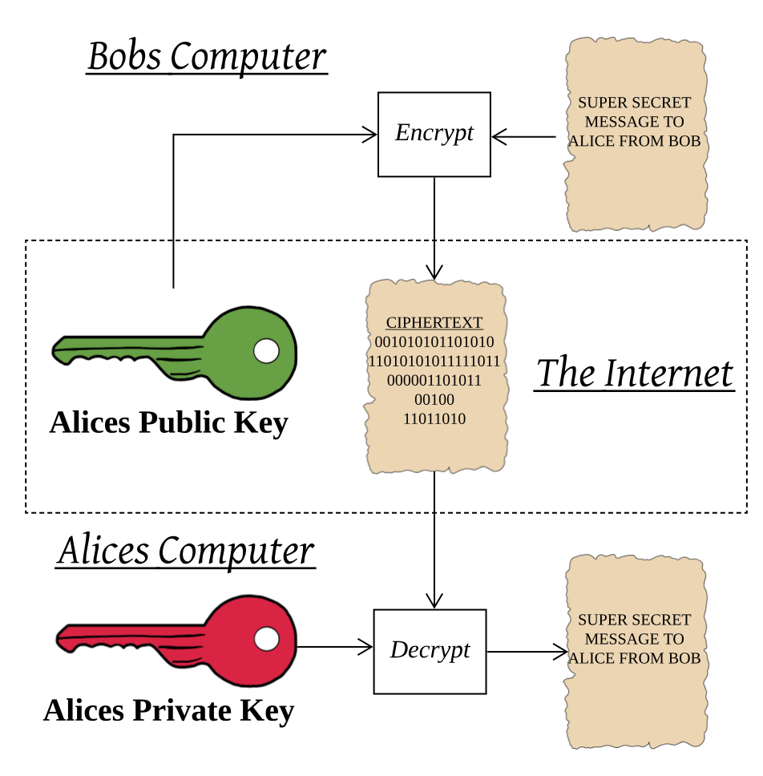
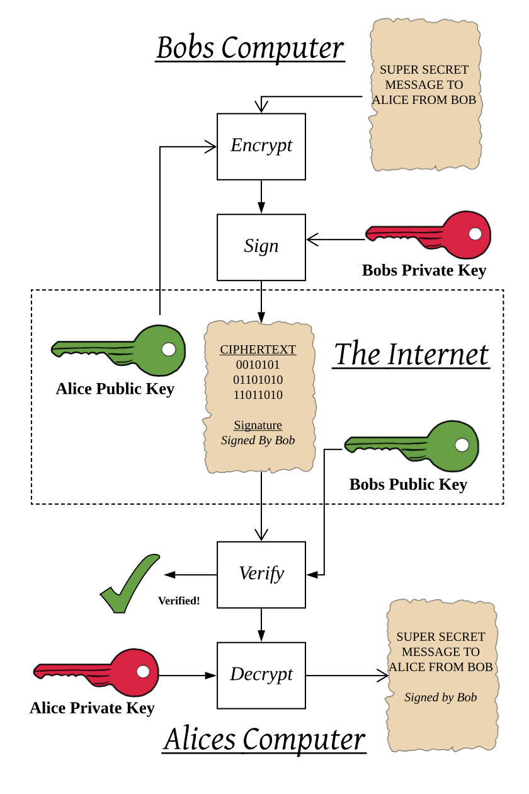
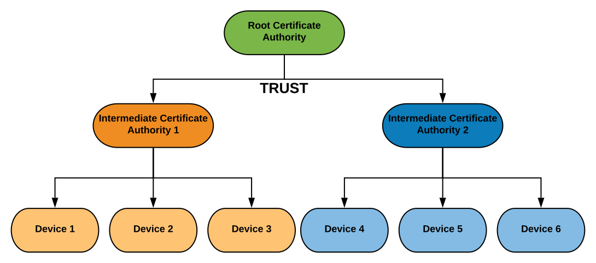

# Crash Course in Cryptography and X.509

*Author: Johan Lofstad, Microchip Technology Inc.*

  

The [AVR-IoT WA](https://www.microchip.com/DevelopmentTools/ProductDetails/ev15r70a?utm_campaign=IoT-WA-DevBoards&utm_source=GitHub&utm_medium=hyperlink&utm_term=&utm_content=microchip-iot-developer-guide-for-aws-crash-course-crypto-x509) and [PIC-IoT WA](https://www.microchip.com/DevelopmentTools/ProductDetails/ev54y39a?utm_campaign=IoT-WA-DevBoards&utm_source=GitHub&utm_medium=hyperlink&utm_term=&utm_content=microchip-iot-developer-guide-for-aws-crash-course-crypto-x509) use the X.509 cryptographic standard to authenticate devices and transfer data securely. This is the same standard most of the web relies on. This document provides a crash course in X.509, explaining the basic concepts required to understand the provisioning process between the IoT Board and AWS. It is recommended to read the [A More Thorough Look into the Provisioning Process](../a-more-thorough-look-into-the-provisioning-process) document after this one.

It uses *Public-Key Cryptography* to provide [confidentiality and authenticity](https://en.wikipedia.org/wiki/Information_security).

> In cryptography, X.509 is a standard defining the format of public-key certificates. X.509 certificates are used in many Internet protocols, including TLS/SSL, which is the basis for HTTPS[2], the secure protocol for browsing the web.
>
> \- [Wikipedia.org - X.509](https://en.wikipedia.org/wiki/X.509)

> *Confidentiality* is the principle that only entities that are authorized to access the data can access the data.
> *Authenticity* is the principle that an entity that is communicated is what it claims to be.

## Table of Contents

- [Crash Course in Cryptography and X.509](#crash-course-in-cryptography-and-x509)
  - [Table of Contents](#table-of-contents)
  - [Public Key Cryptography](#public-key-cryptography)
  - [Signing a Document](#signing-a-document)
  - [The Concept of *Certificates* and X.509](#the-concept-of-certificates-and-x509)
  - [Chain of Trust](#chain-of-trust)
  - [Cryptography in Embedded Solutions](#cryptography-in-embedded-solutions)
  - [Next Steps](#next-steps)
  - [Resources](#resources)

## Public Key Cryptography

In *Public Key Cryptography*, entities have a *key pair*, a non-secret **public key** that can encrypt messages and a secret **private key** that can decrypt messages. As the names suggest, the public key can be shared without any consequence, while the private key is never to be shared.

A private key can, however, only decrypt messages encrypted with its corresponding public key. In other words:

- A Public Key can **encrypt** but not decrypt a message, converting the text into *ciphertext*
- A Private Key can **decrypt** a ciphertext generated by its corresponding public key

> When a message is encrypted, its content is called *ciphertext*

For instance, Bob wants to send Alice a secret message over an insecure medium, *the internet*. As the message is secret, it is important that no one eavesdrops and reads its contents. Alice gives Bob her public key, which Bob uses to encrypt his message into ciphertext. He sends the message to Alice, which uses her private key to decrypt the ciphertext into the message. See the figure below for an illustration.

## Signing a Document

By using a public key pair, *confidentiality* is ensured. Only the intended recipient can read the message. However, *authenticity* has still not been addressed. For instance, in the above example, Alice has no way of knowing that the message indeed came from Bob.

A message can be *signed* with a private key and verified with a public key. In this example, Bob could use his private key to *sign* the message before sending it. Alice uses Bob's public key to verify that the message indeed came from Bob. The figure below illustrates this example, where Bob sends an encrypted and signed message to Alice.

## The Concept of *Certificates* and X.509

A *Certificate* is a document that proves ownership of a public key. The X.509 standard is nothing more than a standard on these certificates. An entity *owns* a public key if it knows the corresponding private key. Some of the contents of a certificate are:

- The public key in question
- Information about the owner
- A signature from an entity that has verified the contents of the certificate

The signature is a digital signature, signed with a private key. It proves that a private key has verified the message (in this case, a certificate). A certificate can be signed by the corresponding private key, making it a *self-signed* certificate. This proves that the sender of the certificate knows the certificates private key.

Conversely, it can be signed by another private key, a *certificate authority (CA)*. The basic idea is as follows: If the CA is trusted, and it again *trusts* the certificate by signing it, the signed certificate is also trusted. This is called the *chain of trust* and is an important concept in X.509.

*If confused, think of certificates as proof that a device indeed is the device it claims to be.*

## Chain of Trust

A *chain of trust* is used to authenticate components (in this case, devices). At the start of the chain, one certificate is trusted fully, a *root certificate*. The issuer/owner of this root certificate is called the  *Certificate Authority (CA)*. Every device that is authenticated to an AWS IoT Project must be trusted somewhere in the chain.

The CA *trusts* some other certificate, for instance, a *Certificate Signer*. This certificate signer again trusts several devices. As trust can be traced up the chain to the CA from a device. The device itself is trusted and authenticated.

A common line of questioning is, "Why do we have a certificate signer? Why not sign the devices directly?". A certificate that signs devices directly is more exposed. More systems need to know about it, so it must be deployed more widely. This increases the chances of the private key being getting compromised. If that happens, the CA must be revoked, destroying the entire chain of trust. If, however, a certificate signer is compromised, only that certificate must be revoked, destroying a smaller part of the tree.

> *In computer security, a chain of trust is established by validating each component of hardware and software from the end entity up to the root certificate.*
>
> \- [*Wikipedia.org - Chain of Trust*](https://en.wikipedia.org/wiki/Chain_of_trust)

> The provisioning tool uses the term *signer certificate authority*, which serves as the *intermediate certificate authority*.

## Cryptography in Embedded Solutions

Any embedded solution which communicates with the internet *securely* requires some kind of *secret* to do so. The secret when using X.509 is the private key. This secret must be stored on the embedded device in a manner where it is not possible to read the secret, and at the same time, be able to decrypt incoming messages to the device. Generally, storing such secrets in any general-purpose memory (such as *flash*) is bad practice.

A higher level of security is achieved by using a *secure element*. The PIC- & AVR-IoT boards use the [**ATECC608A**](https://www.microchip.com/wwwproducts/en/ATECC608A?utm_campaign=IoT-WA-DevBoards&utm_source=GitHub&utm_medium=hyperlink&utm_term=&utm_content=microchip-iot-developer-guide-for-aws-crash-course-crypto-x509), a cryptographic chip that stores the key securely, providing (but not limited to) signing and decrypting capabilities. The MCU never touches the secret and it is never stored in the MCU's memory. The ATECC608A can generate a new key-pair when requested, and through a [*Certificate Signing Request* (CSR)](https://en.wikipedia.org/wiki/Certificate_signing_request) the key can be signed by a CA.

In most IoT solutions with a secure element, every device must be signed by a CA, or the device's secret must be authenticated in some manner. This can introduce a significant cost during manufacturing, as every device has to go through a CSR. Said cost can be mitigated through the [Microchip Trust Platform](https://www.microchip.com/design-centers/security-ics/trust-platform?utm_campaign=IoT-WA-DevBoards&utm_source=GitHub&utm_medium=hyperlink&utm_term=&utm_content=microchip-iot-developer-guide-for-aws-crash-course-crypto-x509), which secure elements that have already been signed. The trust platform comes in three flavors: [Trust&Go](https://www.microchip.com/design-centers/security-ics/trust-platform/trust-go?utm_campaign=IoT-WA-DevBoards&utm_source=GitHub&utm_medium=hyperlink&utm_term=&utm_content=microchip-iot-developer-guide-for-aws-crash-course-crypto-x509), [TrustFlex](https://www.microchip.com/design-centers/security-ics/trust-platform/trustflex?utm_campaign=IoT-WA-DevBoards&utm_source=GitHub&utm_medium=hyperlink&utm_term=&utm_content=microchip-iot-developer-guide-for-aws-crash-course-crypto-x509) and [TrustCUSTOM](https://www.microchip.com/design-centers/security-ics/trust-platform/trustcustom?utm_campaign=IoT-WA-DevBoards&utm_source=GitHub&utm_medium=hyperlink&utm_term=&utm_content=microchip-iot-developer-guide-for-aws-crash-course-crypto-x509), with minimum ordering quantities of 10, 2000 and 4000 devices, respectively.

## Next Steps

  
    

## Resources

- [PIC-IoT WA Development Board Product Page](https://www.microchip.com/DevelopmentTools/ProductDetails/ev54y39a?utm_campaign=IoT-WA-DevBoards&utm_source=GitHub&utm_medium=hyperlink&utm_term=&utm_content=microchip-iot-developer-guide-for-aws-crash-course-crypto-x509)
- [AVR-IoT WA Development Board Product Page](https://www.microchip.com/DevelopmentTools/ProductDetails/ev15r70a?utm_campaign=IoT-WA-DevBoards&utm_source=GitHub&utm_medium=hyperlink&utm_term=&utm_content=microchip-iot-developer-guide-for-aws-crash-course-crypto-x509)
- [Wikipedia.org - X.509](https://en.wikipedia.org/wiki/X.509)
- [Wikipedia.org - Chain of Trust](https://en.wikipedia.org/wiki/Chain_of_trust)
- [Microchip Trust Platform](https://www.microchip.com/design-centers/security-ics/trust-platform?utm_campaign=IoT-WA-DevBoards&utm_source=GitHub&utm_medium=hyperlink&utm_term=&utm_content=microchip-iot-developer-guide-for-aws-crash-course-crypto-x509)
  - [Trust&Go](https://www.microchip.com/design-centers/security-ics/trust-platform/trust-go?utm_campaign=IoT-WA-DevBoards&utm_source=GitHub&utm_medium=hyperlink&utm_term=&utm_content=microchip-iot-developer-guide-for-aws-crash-course-crypto-x509)
  - [TrustFlex](https://www.microchip.com/design-centers/security-ics/trust-platform/trustflex?utm_campaign=IoT-WA-DevBoards&utm_source=GitHub&utm_medium=hyperlink&utm_term=&utm_content=microchip-iot-developer-guide-for-aws-crash-course-crypto-x509)
  - [TrustCUSTOM](https://www.microchip.com/design-centers/security-ics/trust-platform/trustcustom?utm_campaign=IoT-WA-DevBoards&utm_source=GitHub&utm_medium=hyperlink&utm_term=&utm_content=microchip-iot-developer-guide-for-aws-crash-course-crypto-x509)
