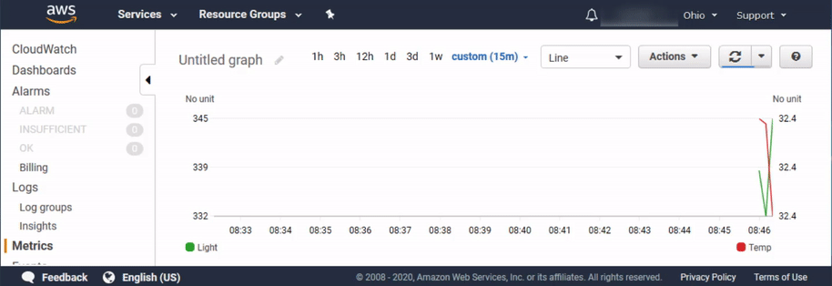
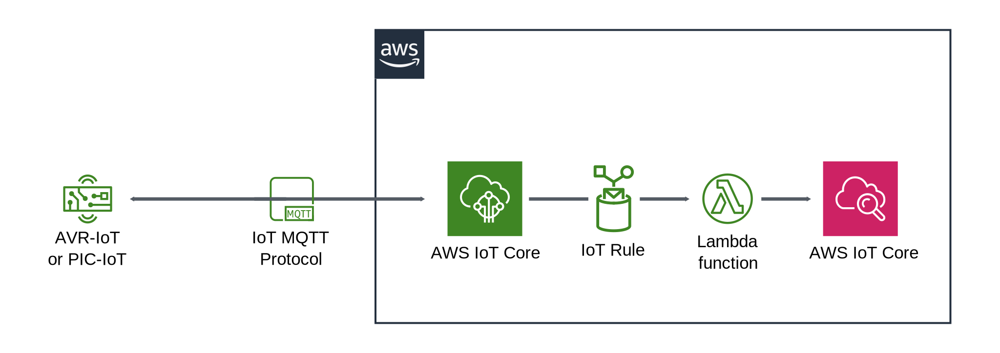
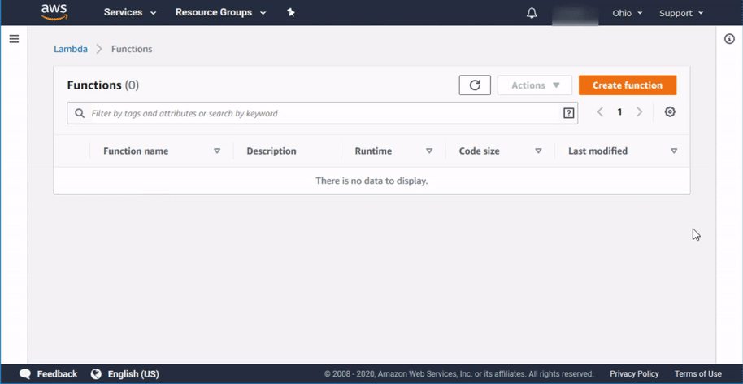
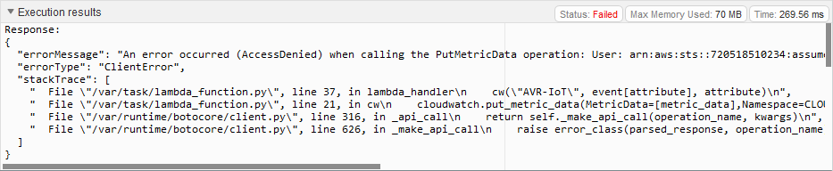
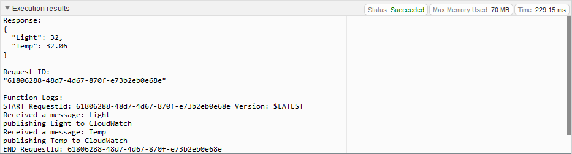
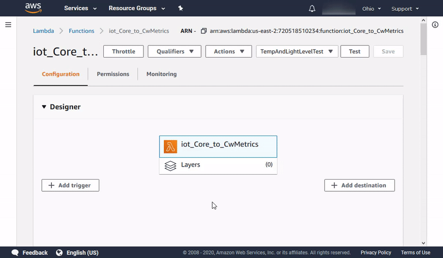
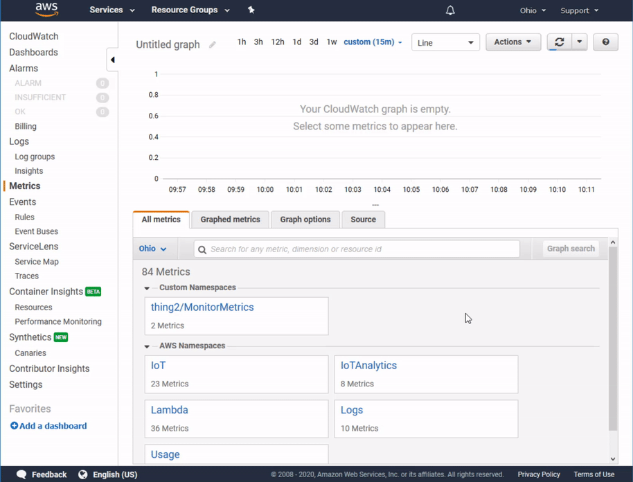

# Device Monitoring in Amazon CloudWatch

*Author: Patrick Kennedy, Microchip Technology Inc.*

## Introduction

In this tutorial, we will showcase how Amazon CloudWatch can be used to monitor sensor data from PIC-IoT and AVR-IoT development boards.

The tutorial assumes that you have a device that is already connected to your AWS account, and that is sending sensor data with the pre-loaded firmware on the [PIC-IoT](https://www.microchip.com/DevelopmentTools/ProductDetails/ev54y39a?utm_campaign=IoT-WA-DevBoards&utm_source=GitHub&utm_medium=hyperlink&utm_term=&utm_content=microchip-iot-developer-guide-for-aws-device-monitor-cloudwatch-intro) or [AVR-IoT](https://www.microchip.com/DevelopmentTools/ProductDetails/ev15r70a?utm_campaign=IoT-WA-DevBoards&utm_source=GitHub&utm_medium=hyperlink&utm_term=&utm_content=microchip-iot-developer-guide-for-aws-device-monitor-cloudwatch-intro) board, as outlined [here](./../Connect%20the%20Board%20to%20your%20AWS%20Account/README.md).

The pre-loaded firmware configures the IoT boards to send temperature and light sensor data to AWS every second. In this tutorial, we will forward those messages to Amazon CloudWatch to monitor the state of the device in near real-time (from 10 seconds to 15 minutes latency).

To do so, we will create an [AWS Lambda](https://docs.aws.amazon.com/lambda/latest/dg/welcome.html) function that:

1. Processes the event.
2. Extracts the sensor data from the payload.
3. Pushes it to a CloudWatch metric namespace for near real-time data visualization.

Check out the real-time visualization in the time-lapse animation below:



> Amazon CloudWatch monitors your Amazon Web Services (AWS) resources and the applications you run on AWS in real-time. You can use CloudWatch to collect and track metrics, which are variables you can measure for your resources and applications.
>  
> [AWS Documentation: Amazon CloudWatch User Guide](https://docs.aws.amazon.com/AmazonCloudWatch/latest/monitoring/WhatIsCloudWatch.html)

Note that the closest to "real-time" we can get - such as in the [sandbox](../Access%20the%20Sandbox) - requires a more entailed approach that involves storing the data in a real-time processing database such as [Amazon DynamoDB](https://docs.aws.amazon.com/amazondynamodb/latest/developerguide/Introduction.html).

## Table of Contents

- [Device Monitoring in Amazon CloudWatch](#device-monitoring-in-amazon-cloudwatch)
  - [Introduction](#introduction)
  - [Table of Contents](#table-of-contents)
    - [System Overview](#system-overview)
  - [Step-by-Step Instructions](#step-by-step-instructions)
    - [Step 1: Set up the Lambda Function](#step-1-set-up-the-lambda-function)
    - [Step 2: Configure IoT Core Rule](#step-2-configure-iot-core-rule)
    - [Step 3 See Results in CloudWatch Metrics](#step-3-see-results-in-cloudwatch-metrics)
  - [Next Steps](#next-steps)
  - [Resources](#resources)

### System Overview

Below is a diagram of the system architecture for reference.



## Step-by-Step Instructions

### Step 1: Set up the Lambda Function

First, we will create the [AWS Lambda](https://aws.amazon.com/lambda/) function that will process and push MQTT messages from AWS IoT Core to Amazon CloudWatch. Lambda functions follow the broader paradigm of [serverless computing](https://en.wikipedia.org/wiki/Serverless_computing), where simple functions can be written in code without the need for configuring and managing servers and other hardware.

This provides consistent performance, and continuous scaling as an IoT system grows in size. Cloud providers manage the allocation of resources, and users are billed primarily based on the number of resources consumed by their application.

1. Navigate to the AWS Lambda service console and create a new Lambda function with the name `iot_Core_to_CwMetrics`. Use **Python 3.8** as the runtime, and select **Create a new role with basic Lambda permissions** under **Execution role**.
   
2. Scroll down to the **Function Code** section, and copy the code below into the code editor. Remember to click the **Save** button afterward.

   ```python
   import json # Python library for dealing with JSON objects
   import boto3 # boto3 is the AWS SDK for Python

   cloudwatch = boto3.client('cloudwatch')

   # Define payload attributes that may be changed based on device message schema
   ATTRIBUTES = ['Light','Temp']

   # Define CloudWatch namespace
   CLOUDWATCH_NAMESPACE = "thing2/MonitorMetrics"

   # Define function to publish the metric data to CloudWatch
   def cw(topic, metricValue, metricName):
       metric_data = {
           'MetricName': metricName,
           'Dimensions': [{'Name': 'topic', 'Value': topic}],
           'Unit': 'None',
           'Value': metricValue,
           'StorageResolution': 1
       }

       cloudwatch.put_metric_data(MetricData=[metric_data],Namespace=CLOUDWATCH_NAMESPACE)
       return

   # Define the handler to loop through all the messages and looks to see if the message    attributes
   # include light or temp and calls the cw() function if so to publish the custom metrics    to Amazon CloudWatch
   def lambda_handler(event, context):
       # TODO implement
       for e in event:
           print("Received a message: {}".format(str(e)))
           # print(e) # Potential test point

           # Iterate through each attribute we'd like to publish
           for attribute in ATTRIBUTES:
               # Validate the event payload contains the desired attribute
               if attribute in e:
                   print("publishing {} to CloudWatch".format(attribute))
                   cw("AVR-IoT", event[attribute], attribute)
       return event
   ```

   - The key function here is the `lambda_handler` function, which will be invoked every time the Lambda function is triggered. The code above simply loops through the event data (e.g., the JSON payload from AWS IoT Core) for the defined `ATTRIBUTES`, and subsequently pushes those `ATTRIBUTES` to a user-defined `CLOUDWATCH_NAMESPACE` where the device data can be found later on.
3. To facilitate testing of our Lambda function, let us create a *test event* with some example data:
   1. On the configuration page for the `iot_Core_to_Cw_Metrics` Lambda function, select **Configure test events** in the dropdown menu next to the **Test** button.
   2. Select **Create new test event** and make sure `hello-world` is selected as the **Event template**.
   3. Enter `TempAndLightLevelTest` as the **Event name**.
   4. Replace the default code snippet with the code below:

      ```json
      {
        "Light": 32,
        "Temp": 32.06
      }
      ```

   5. Click **Create**.
4. Click the **Test** button in the top right corner to test the newly created Lambda function. Now, inspecting the **Execution results** log below the code editor, we notice that the Lambda function has not been executed successfully.  The reason for this is that the Lambda function has not yet been given permissions to access the Amazon CloudWatch resource. Let us fix that:
   1. Navigate to the [IAM console](https://console.aws.amazon.com/iam/home) and select **Roles** in the menu on the left-hand side.
   2. Select the role that was created in step 1 previously. It will be named `iot_Core_to_CwMetrics-role-********` where the asterisks will be a randomly generated sequence of characters.
   3. Click **Attach policies**.
   4. Use the search bar to find the `CloudWatchFullAccess` and `AWSIoTFullAccess` policies and tick the boxes to select them.
   5. Click **Attach policy**.
5. Return to the Lambda function that was created previously and try to run the test event one more time. This time it should succeed. 

### Step 2: Configure IoT Core Rule

In the previous step, we configured an AWS Lambda function to process sensor data and send it to Amazon CloudWatch. In this step, we will create an AWS IoT *Rule* that registers sensor data received in the AWS IoT Core module and relays it to AWS Lambda for processing. The IoT Rule can be created both from AWS IoT Core directly and from the configuration interface for the Lambda function directly.

1. In the **Designer** panel, click on **Add trigger**.
2. Select `AWS IoT` as the trigger from the dropdown menu.
3. Select **Custom IoT rule**.
4. In the **Rule** dropdown menu, select `Create a new rule`.
5. Enter `IoTCore_to_Cw_Rule` as the **Rule name**.
6. Enter the following query as the **Rule query statement**.

   ```sql
   SELECT * FROM 'thingName/sensors'
   ```

   - Remember to replace `thingName` in the query with your device's thing name. The thing name can be found in AWS IoT Core under **Manage -> Things** in the menu on the left-hand side. Note also that the thing name should be lowercase for the IoT boards.
7. Ensure that the **Enable trigger** checkbox is checked.
8. Click **Add**.



Note that the IoT Core Rule can be created in AWS IoT Core as well, but it will not automatically be assigned to the Lambda function as a trigger. If the rule is created in AWS IoT Core directly, it is, therefore, necessary to manually add the trigger to the Lambda function. To do that, follow the steps above, but select the existing rule instead of `Create a new rule` in the dropdown menu in step 4 above.

### Step 3 See Results in CloudWatch Metrics

1. Navigate to Amazon CloudWatch and click on **Metrics** in the menu on the left-hand side.
2. In the **Custom Namespaces** section, click on the `thing2/MonitorMetrics` metric (we defined the name of this namespace in the Lambda function earlier).
3. Select the `topic` metric.
4. Tick the boxes next to both the `Temp` and `Light` metrics.
5. The data should now be plotted, and you can play around with the settings for the graphed metrics (period, auto-refresh, line, or stacked) to get the visualization you desire.



## Next Steps


## Resources

- [PIC-IoT WA Development Board Product Page](https://www.microchip.com/DevelopmentTools/ProductDetails/ev54y39a?utm_campaign=IoT-WA-DevBoards&utm_source=GitHub&utm_medium=hyperlink&utm_term=&utm_content=microchip-iot-developer-guide-for-aws-device-monitor-cloudwatch-resources)
- [AVR-IoT WA Development Board Product Page](https://www.microchip.com/DevelopmentTools/ProductDetails/ev15r70a?utm_campaign=IoT-WA-DevBoards&utm_source=GitHub&utm_medium=hyperlink&utm_term=&utm_content=microchip-iot-developer-guide-for-aws-device-monitor-cloudwatch-resources)
- [Amazon CloudWatch Documentation](https://docs.aws.amazon.com/AmazonCloudWatch/latest/monitoring/WhatIsCloudWatch.html)
- [AWS Lambda Documentation](https://docs.aws.amazon.com/lambda/latest/dg/welcome.html)
- [AWS IAM User Guide](https://docs.aws.amazon.com/IAM/latest/UserGuide/introduction.html)
