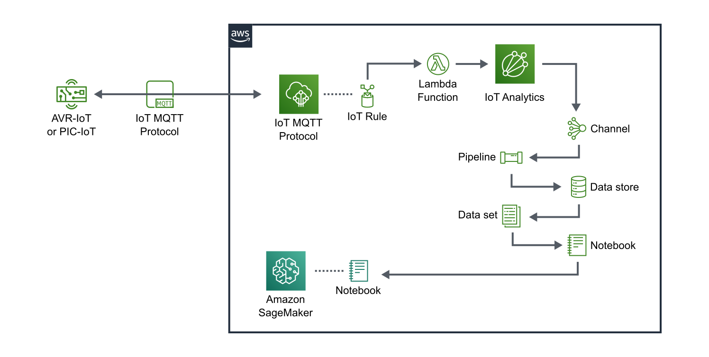
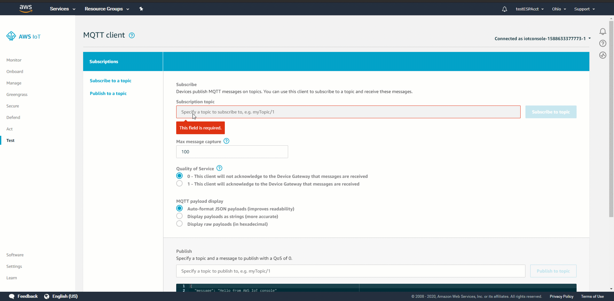
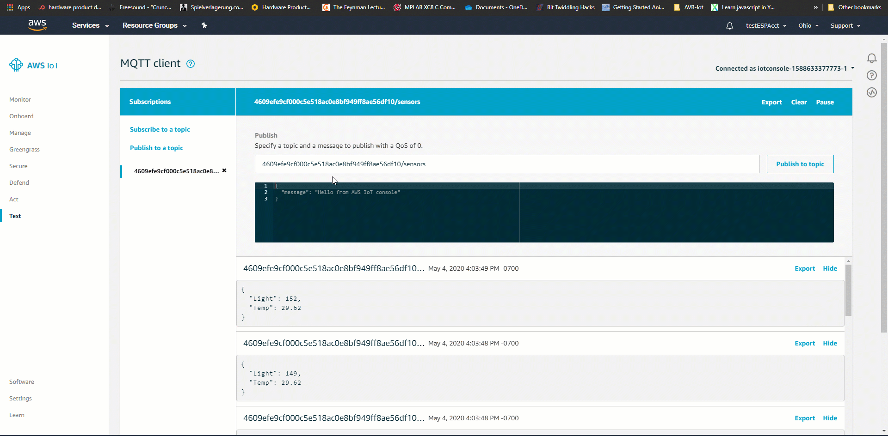
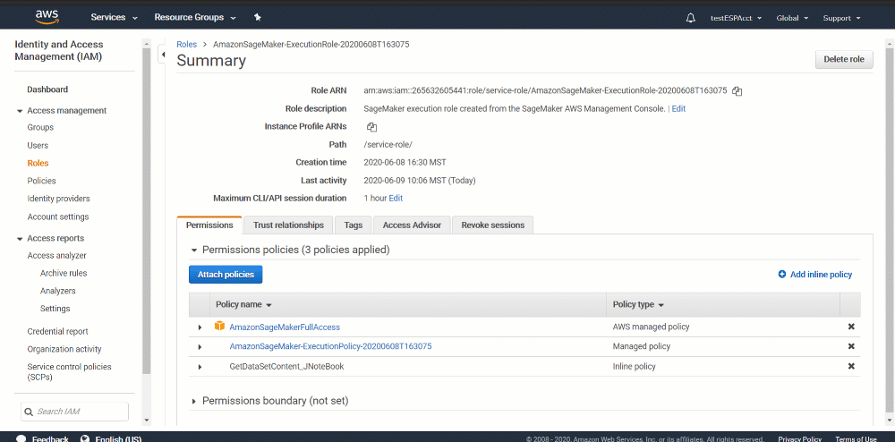
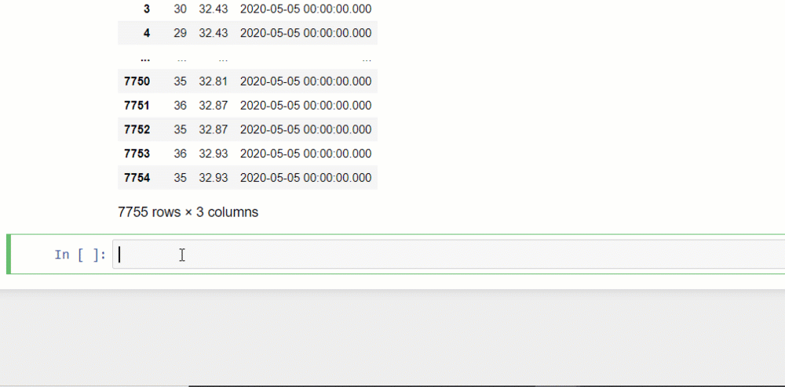
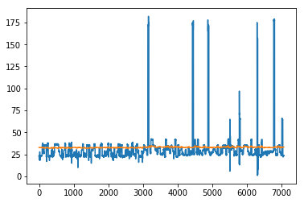

# Visualizing Sensor Data With Jupyter Notebooks

*Author: Patrick Kennedy, Microchip Technology Inc.*

## Introduction

This tutorial will show you how to get data from [AWS IoT Core](https://docs.aws.amazon.com/iot/latest/developerguide/what-is-aws-iot.html) to the ubiquitous [Jupyter Notebook](https://jupyter.org/) environment commonly used for data exploration, analytics, modeling, and visualization.

Note this tutorial assumes you have a [PIC-IoT](https://www.microchip.com/DevelopmentTools/ProductDetails/ev54y39a?utm_campaign=IoT-WA-DevBoards&utm_source=GitHub&utm_medium=hyperlink&utm_term=&utm_content=microchip-iot-developer-guide-for-aws-sensor-viz-jupy-nb-intro) or [AVR-IoT](https://www.microchip.com/DevelopmentTools/ProductDetails/ev15r70a?utm_campaign=IoT-WA-DevBoards&utm_source=GitHub&utm_medium=hyperlink&utm_term=&utm_content=microchip-iot-developer-guide-for-aws-sensor-viz-jupy-nb-intro) Development Board, and that this board is successfully sending sensor data to AWS IoT Core. A tutorial on how to set up the IoT boards is available [here](../connect-the-board-to-your-aws-account).

> AWS IoT Analytics automates the steps required to analyze data from IoT devices. AWS IoT Analytics
filters, transforms, and enriches IoT data before storing it in a time-series data store for analysis.
>  
> \- [AWS IoT Analytics Documentation](https://docs.aws.amazon.com/iotanalytics/latest/userguide/welcome.html)

As noted above, AWS IoT Analytics automates the steps required to build a scalable system that ingests, processes, and analyzes IoT data. The nature of IoT systems requires an architecture that offers long-term storage, asynchronous event management, real-time processing, and analysis tools. Similar systems can be built from scratch using other AWS services, but IoT Analytics provides a quick and easy method of correctly setting up the cloud architecture in the correct manner as recommended by the AWS team. The service is far easier to use and can be further extended to other AWS services via the channel and pipeline activities described below.

Jupyter Notebook is a web-based interactive environment praised for inline documentation and a staple in data science. Jupyter Notebooks are a great way to explore newly created data sets and are further useful in terms of portability and containerization for deployment.

Furthermore, the Jupyter Notebook environment created here is hosted directly on AWS, giving easy access to Amazon SageMaker services that provides the ability to seamlessly build, train, and deploy machine learning models for a variety of applications such as anomaly detection and predictive maintenance.

## Table of contents

- [Visualizing Sensor Data With Jupyter Notebooks](#visualizing-sensor-data-with-jupyter-notebooks)
  - [Introduction](#introduction)
  - [Table of contents](#table-of-contents)
  - [System Overview](#system-overview)
  - [Walk-Through](#walk-through)
    - [Step 0: Prerequisites](#step-0-prerequisites)
    - [Step 1: Configure IoT Analytics](#step-1-configure-iot-analytics)
    - [Step 2: Create and Configure a SageMaker Notebook Instance](#step-2-create-and-configure-a-sagemaker-notebook-instance)
  - [Reference Jupyter Code](#reference-jupyter-code)
  - [Conclusion](#conclusion)
  - [Next Steps](#next-steps)
  - [Resources](#resources)

## System Overview


Above is an outline showing the system created when following the tutorial below. For more details on what each of the components above (e.g., channel, pipeline, etc.) provides, see the mini user guides provided by AWS. A brief description of each is included below for reference.

[**Channels**](https://d1.awsstatic.com/IoT/User%20Guide%20PDFs/01_AWS_Mini-User_Guide_Channels_August2018.pdf) - A Channel ingests data and feeds it to a Pipeline(s) while keeping a copy of the raw MQTT messages for a certain time. This can be likened to a real-time database where data is continuously received and handled.

[**Pipelines**](https://d1.awsstatic.com/IoT/User%20Guide%20PDFs/02_AWS_Mini-User_Guide_Pipelines_August2018.pdf) - A Pipeline provides mechanisms for enriching, cleaning, and transforming IoT messages of various structures. An example of this might be enriching data with weather information from the national weather service.

[**Data Stores and Data Sets**](https://d1.awsstatic.com/IoT/User%20Guide%20PDFs/03_AWS_Mini-User_Guide_Datastores-and-Datasets_August2018.pdf) - Data stores are time-partitioned SQL database tables for useful long-term storage of IoT data. Data sets are typically created from Data stores by running SQL queries that effectively extract, transform, and load (ETL) that can be run on an ad-hoc basis or scheduled periodically. The Jupyter notebook becomes useful here as it can perform all the analysis needed by loading the data set into the notebook and running the code. Furthermore, the Jupyter Notebook can be deployed as a Docker container.

A [Docker container](https://aws.amazon.com/docker/) is essentially an application that includes a manifest outlining the dependencies and configurations needed to run the application. Similar to how a virtual machine allows an Operating System to run on any piece of hardware, a Docker container allows an application to run on any Operating System. This becomes useful in scaling and portability as it means our analyses can be cloned and run on a variety of platforms.

## Walk-Through

### Step 0: Prerequisites

Before starting, you should have a secure connection setup between your device and IoT Core, which you can verify by viewing incoming messages to the MQTT Client within the IoT Core console, as shown below.

If unsure how to do this, see [Connect the Board to your AWS Account](../connect-the-board-to-your-aws-account).



### Step 1: Configure IoT Analytics

First, we need to configure an IoT Core rule to send a message to IoT Analytics. In the process of creating the rule, we will use the quick create function that will automatically create all the resources needed from IoT Analytics (e.g., channel, pipeline, data store, data set, etc.).

> AWS IoT Analytics automates the steps required to analyze data from IoT devices. AWS IoT Analytics
filters, transforms, and enriches IoT data before storing it in a time-series data store for analysis.
>  
> \- [AWS IoT Analytics Documentation](https://docs.aws.amazon.com/iotanalytics/latest/userguide/welcome.html)



1. Copy the subscription topic: `thingName/sensors`, where `thingName` is the unique name for your device.
   - (e.g. `4609efe9cf000c5e518ac0e8bf949ff8ae56df10/sensors`)
2. Create a new rule in IoT Core.
   - In the left-hand pane, navigate to **Act -> Rules** and click the blue **"Create"** button on the right-hand side to create a new rule. This will open the create rule GUI.
3. Let's start first with the action by scrolling down to the **"Set one or more actions"** section just below the code editor. Click **"Add action"**.
4. Select **"Send a message to IoT Analytics"** and click the **"Configure action"** button.
5. We are prompted to manually select an IoT Analytics channel and role OR just quickly create one.
   1. Select **"Quick create IoT Analytics resources"** and enter `JupyterTutorial` as the **Resource prefix**. You will notice that this automatically generates and configures a generic channel, data store, pipeline, data set, and role necessary for basic operation.  
   2. Click the **"Add Action"** button on the bottom of screen.
6. Proceed by naming your rule and giving it a brief description.
7. Under **Rule query statement**, enter the code below. Remember to replace `thingName` with your device's thing name. Note that this is a SQL statement for which you can find further documentation [here](https://docs.aws.amazon.com/iot/latest/developerguide/iot-sql-reference.html).

   ```sql
   SELECT * FROM 'thingName/sensor'
   ```

8. Click **"Create rule"**.
9. Enable the rule by clicking on the three dots next to the rule and selecting **"Enable Rule"**. (**Hint:** If it is not showing up, try switching to the list view.)
10. Navigate to your data set: **IoT Analytics Console -> Data Set**. You can find the IoT Analytics console by using the AWS Services search feature on the toolbar at the top of the page. Click on the three-dot menu next to your data set and select **Run now**. This will run the SQL query you wrote in step 7.
11. **SUCCESS** - check out the IoT Analytics data set you just created! You can do this by opening the data set and seeing the result preview. It includes data recently published from the MQTT messages.


### Step 2: Create and Configure a SageMaker Notebook Instance


1. Create the Notebook Instance:
   1. Navigate to Amazon Sagemaker and select **Notebook instances** in the menu on the left-hand side.
   2. Click **Create notebook instance**. (Orange button on the top right-hand side.)
   3. Leave settings as default, which should include a medium-sized instance and elastic inference disabled.
      > The **instance size** is how much cloud space you are afforded, so more data/computation might require more space. Additionally, elastic inference GPU acceleration for instances that can take advantage of parallel workflows to speed up the inference rate for a deployed model. The inference rate of model is similar to the interrupt latency of an embedded system, in that it is measured by how quickly a response can be "inferred" (e.g., classification) for a given input.
   4. Create an IAM role for the notebook under **Permissions and encryption** -> **IAM Role** (drop-down menu) -> Select **"Create role"** to create a role with the default settings.
   5. Click **Create notebook instance**. (Orange button on the bottom right-hand corner.)
   6. Continue only when the notebook instance is **"InService"**. This may take a couple of minutes, and you might need to refresh for it to notify you.

   

2. Modify the SageMaker NoteBook instance role:
   1. Navigate back to **IoT Analytics Console -> Data sets**.
   2. Click on the data set that you created and copy the data set *ARN*. We need to add this to the SageMaker role permissions within the IAM console.
      > Amazon Resource Names (ARNs)    uniquely identify AWS resources.
      >  
      > \- AWS General Reference Guide:  [Amazon Resource Names (ARNs)](https://docs.aws.amazon.com/general/latest/gr/aws-arns-and-namespaces.html)
   3. Navigate to **IAM console -> Roles** (Left-hand pane under Access Management). Then click on the SageMaker role.
   4. Create and add a `GetDatasetContent` policy to the SageMaker role:
      1. Select **"Add Inline Policy"**.
      2. For **Service**, select **"IoT Analytics"**.
      3. For **Actions**, type **"GetDatasetContent"**.
      4. Add the Data Set ARN you copied previously from IoT Analytics.
      5. Click **"Review Policy"**.
      6. Give it a name and create the policy.
   5. Ensure that the policy is added to the SageMaker role before continuing.
3. Create a new Notebook:
   1. Navigate back to **IoT Analytics Console -> Notebooks**.
   2. Click the blue **"Create"** button on the right-hand side to create a new notebook.
   3. Select **"Blank Notebook"** and give the notebook a name.
   4. Select the data set and notebook instance you just created and click **"Create Notebook"**.
   
4. Configure the Notebook environment:
   1. Within the Notebooks section of the IoT Analytics Console, find and open the notebook you just created (`.ipynb` extension).
   2. Select the `conda_python3` kernel:
      - In the toolbar, select: **"Kernel" -> "Change Kernel" -> "conda_python3"**.
5. Write Python code to output and plot the sensor data. The required code, as well as an example output, is provided in the [Reference Jupyter Code](#reference-jupyter-code) section below.
   1. First, we will need to import the `pandas` library that will allow us to read the CSV-formatted data set and store it in a *DataFrame*.
      > A DataFrame is a pandas object similar to an array that is commonly used in conjunction with machine learning and AI frameworks such as Tensorflow, Keras, and PyTorch.
   
   1. Second, we will need to import the `pyplot` function from the `matplotlib` library, which will allow us to easily plot the DataFrame we just stored. 

## Reference Jupyter Code

```python
dataset = "iotanalyticstestproject_dataset"
dataset_url = client.get_dataset_content(datasetName = dataset)['entries'][0]['dataURI']

# start working with the data
```

```python
import pandas as pd
#load the dataset


df=pd.read_csv(dataset_url)
df
```

|   | light | temp  | __dt                    |
|---|-------|-------|-------------------------|
| 0 | 23    | 32.93 | 2020-05-05 00:00:00.000 |
| 1 | 24    | 32.87 | 2020-05-05 00:00:00.000 |
| 2 | 22    | 32.87 | 2020-05-05 00:00:00.000 |
| 3 | 20    | 32.93 | 2020-05-05 00:00:00.000 |
| 4 | 19    | 32.87 | 2020-05-05 00:00:00.000 |
| 5 | 20    | 32.87 | 2020-05-05 00:00:00.000 |
| 6 | 22    | 32.87 | 2020-05-05 00:00:00.000 |

```python
import matplotlib.pyplot as plt
plt.plot(df['light'])
plt.plot(df['temp'])

```



## Conclusion

This tutorial showed how to get data from AWS IoT Core to a Jupyter Notebook environment. Now that your environment is set up, try applying SageMaker models or other Python libraries to your data.

Alternatively, you can [automate your workflow](https://docs.aws.amazon.com/iotanalytics/latest/userguide/automate.html) by deploying your notebook as a container so that it runs locally or remotely, and may further update periodically via an IoT Analytics data set update.

## Next Steps

[](../device-monitoring-in-amazon-cloudWatch)

## Resources

- [PIC-IoT WA Development Board Product Page](https://www.microchip.com/DevelopmentTools/ProductDetails/ev54y39a?utm_campaign=IoT-WA-DevBoards&utm_source=GitHub&utm_medium=hyperlink&utm_term=&utm_content=microchip-iot-developer-guide-for-aws-sensor-viz-jupy-nb-resources)
- [AVR-IoT WA Development Board Product Page](https://www.microchip.com/DevelopmentTools/ProductDetails/ev15r70a?utm_campaign=IoT-WA-DevBoards&utm_source=GitHub&utm_medium=hyperlink&utm_term=&utm_content=microchip-iot-developer-guide-for-aws-sensor-viz-jupy-nb-resources)
- [AWS IoT Analytics User Guide](https://docs.aws.amazon.com/iotanalytics/latest/userguide/welcome.html)
- [AWS IoT Developer Guide](https://docs.aws.amazon.com/iot/latest/developerguide/what-is-aws-iot.html)
- [Channels Mini Guide](https://d1.awsstatic.com/IoT/User%20Guide%20PDFs/01_AWS_Mini-User_Guide_Channels_August2018.pdf)
- [Pipelines Mini Guide](https://d1.awsstatic.com/IoT/User%20Guide%20PDFs/02_AWS_Mini-User_Guide_Pipelines_August2018.pdf)
- [Data Stores and Data Sets Mini Guide](https://d1.awsstatic.com/IoT/User%20Guide%20PDFs/03_AWS_Mini-User_Guide_Datastores-and-Datasets_August2018.pdf)
