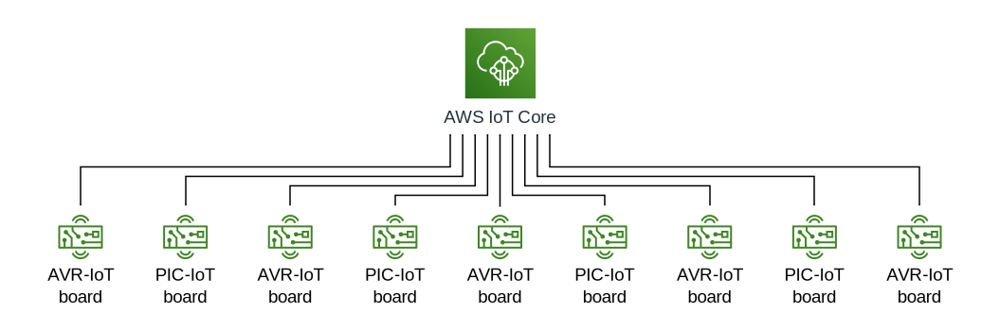
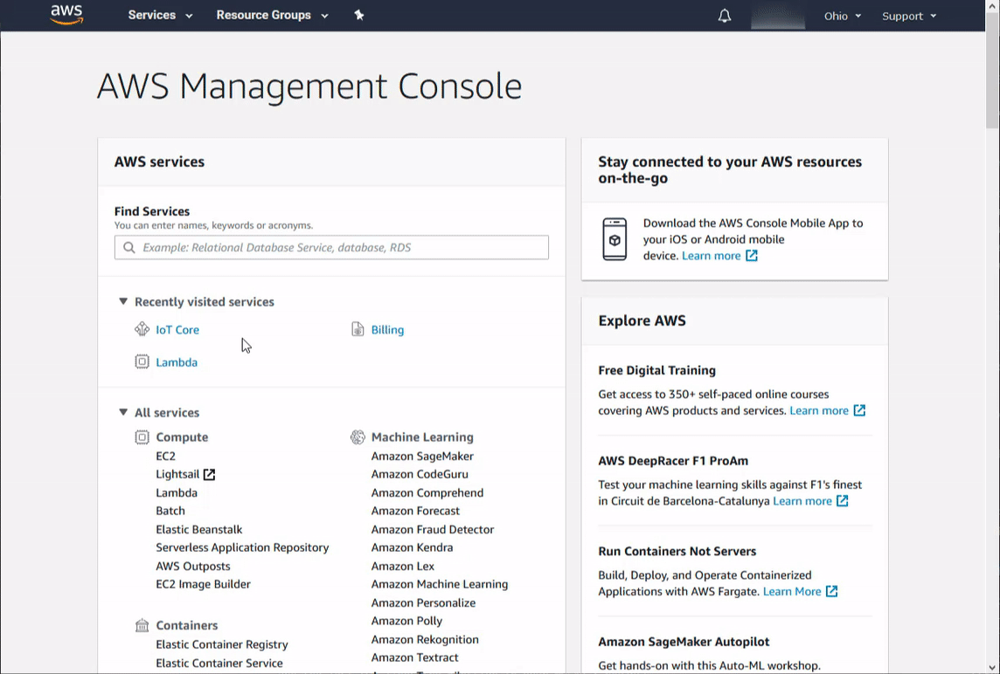
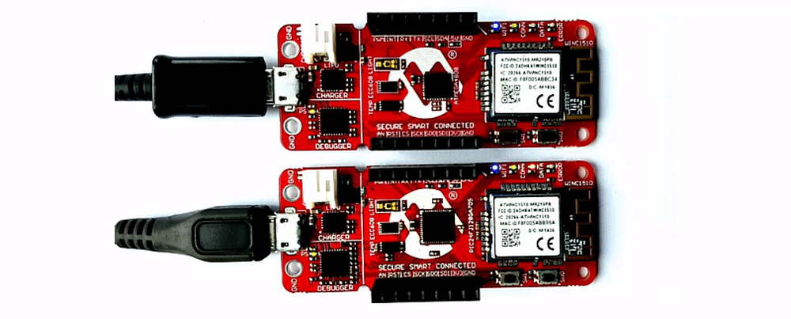

# Your First Application – Sending and Receiving Data

*Author: Lars Olav Skrebergene, Microchip Technology Inc.*

<p align="middle">
  <a href="../../issues"></a>
</p>

## Introduction

In this tutorial, we will showcase how the AVR-IoT and PIC-IoT Development Boards can be configured to communicate with the cloud using Amazon Web Services® (AWS) and the MQTT messaging protocol.

We will walk you through how to develop an example application where a network of IoT devices are configured to blink their LEDs whenever a button is pressed on any of them. Detailed step-by-step instructions will be provided and relevant concepts will also be covered as we go.

The primary goal of this tutorial is for the reader to experience how to develop their own applications with the AVR-IoT and PIC-IoT Development Boards.

### Prerequisites

It is assumed that the reader has already provisioned their PIC-IoT and/or AVR-IoT Development Board(s) to communicate with their own AWS account, as described in the previous tutorial: [Connecting to AWS with the IoT Provisioning Tool](../connect-the-board-to-your-aws-account).

Before starting this tutorial, make sure that your IoT device(s) are successfully sending sensor data to AWS IoT Core. It is also assumed that the reader has installed the [MPLAB® X IDE](https://www.microchip.com/mplab/mplab-x-ide?utm_campaign=IoT-WA-DevBoards&utm_source=GitHub&utm_medium=hyperlink&utm_term=&utm_content=microchip-iot-developer-guide-for-aws-first-app-send-receive-data-prequisites) and the [XC8](https://www.microchip.com/mplab/compilers?utm_campaign=IoT-WA-DevBoards&utm_source=GitHub&utm_medium=hyperlink&utm_term=&utm_content=microchip-iot-developer-guide-for-aws-first-app-send-receive-data-prequisites) (AVR-IoT) or [XC16](https://www.microchip.com/mplab/compilers?utm_campaign=IoT-WA-DevBoards&utm_source=GitHub&utm_medium=hyperlink&utm_term=&utm_content=microchip-iot-developer-guide-for-aws-first-app-send-receive-data-prequisites) (PIC-IoT) compiler.

Links to software and other useful tools and guides are provided in the [Resources](#resources) section at the end of this tutorial.

## Table of Contents

- [Your First Application – Sending and Receiving Data](#your-first-application--sending-and-receiving-data)
  - [Introduction](#introduction)
    - [Prerequisites](#prerequisites)
  - [Table of Contents](#table-of-contents)
  - [A Brief Introduction to the Firmware of the IoT Boards](#a-brief-introduction-to-the-firmware-of-the-iot-boards)
  - [Implementing the Example Application](#implementing-the-example-application)
    - [Step 0: Update the AWS IoT Core Policy](#step-0-update-the-aws-iot-core-policy)
    - [Step 1: Start With an Unmodified Version of the Github Project](#step-1-start-with-an-unmodified-version-of-the-github-project)
    - [Step 2: Sending MQTT Messages to the Cloud](#step-2-sending-mqtt-messages-to-the-cloud)
      - [Procedures for AVR-IoT Boards](#procedures-for-avr-iot-boards)
      - [Procedures for PIC-IoT Boards](#procedures-for-pic-iot-boards)
      - [Procedures for Both AVR-IoT and PIC-IoT Boards](#procedures-for-both-avr-iot-and-pic-iot-boards)
      - [Verify That Messages Are Successfully Being Sent to AWS](#verify-that-messages-are-successfully-being-sent-to-aws)
    - [Step 3: Receiving MQTT Messages From the Cloud](#step-3-receiving-mqtt-messages-from-the-cloud)
  - [Next Steps](#next-steps)
  - [Resources](#resources)

## A Brief Introduction to the Firmware of the IoT Boards

The firmware that is pre-loaded onto the PIC-IoT and AVR-IoT Development Boards is available on GitHub and will form the starting point for the example application we will design in this tutorial. The MPLAB X projects for the different microcontroller families can be found here:

- [GitHub repository for the **PIC**-IoT Development Boards](https://github.com/microchip-pic-avr-solutions/pic-iot-aws-sensor-node)
- [GitHub repository for the **AVR**-IoT Development Boards](https://github.com/microchip-pic-avr-solutions/avr-iot-aws-sensor-node-mplab)

The `PICIoT.X` and `AVRIoT.X` projects contain many different files that handle cryptography, Wi-Fi connectivity, MQTT communication, and so on. In this tutorial, we will primarily work with `application_manager.c`, which is located under `Source Files -> MCC Generated Files` in MPLAB X. This file contains a lot of useful high-level functions that make it easy to develop an AWS application.

Here is a summary of some important functions in `application_manager.c` that is relevant for this tutorial:

- `subscribeToCloud`
  - Defines which MQTT topics the IoT board should be subscribed to and which functions should be run when messages are received to these topics. In the unmodified `PICIoT.X` and `AVRIoT.X` projects, the board is only subscribed to its device shadow update MQTT topic, and `receivedFromCloud` is the function specified to handle these updates.
- `receivedFromCloud`
  - Runs when an MQTT shadow update message is received in the unmodified `PICIoT.X` or `AVRIoT.X` projects. This function analyzes the message and performs some action based on its contents. It then calls the `updateDeviceShadow` function to acknowledge that the shadow update has been received.
- `sendToCloud`
  - Called every second to send sensor data to the cloud as MQTT messages. This function is a good template to learn how to send custom MQTT messages to custom MQTT topics using the IoT boards.

We recommend the reader to take a quick look at `application_manager.c`, and, in particular, these functions, to get an overview of the existing functionality.

## Implementing the Example Application

In this example, we will demonstrate how devices can be configured to send and receive messages over custom MQTT topics. An example application will be implemented where button presses on any of the configured devices will cause all devices to flash their LEDs. All communication will be sent between the IoT Boards and AWS IoT Core, as illustrated in the schematic below. No direct device-to-device communication will be used.



### Step 0: Update the AWS IoT Core Policy
In the [previous tutorial](../connect-the-board-to-your-aws-account), we provisioned the IoT boards using the [IoT Provisioning Tool](http://www.microchip.com/mymicrochip/filehandler.aspx?ddocname=en1001525). This generated an AWS IoT Core Policy that determines which permissions the boards have when they interact with AWS resources. By default, this policy is configured to only grant an IoT board the right to publish and subscribe to MQTT topics containing the board's thing name.

In this tutorial, we will send and receive MQTT messages over the `buttonPresses` topic. We must, therefore, expand the permissions to also include this topic:

1. Open the [IoT Core](https://us-east-2.console.aws.amazon.com/iot/home) module in AWS and select **Secure -> Policies** in the menu on the left-hand side.
2. Open **zt_policy** and scroll down to the **Policy document** section.
3. Click **Edit policy document** and perform the changes described below.
   1. Update the `iot:Publish` and `iot:Receive` permissions to include the `buttonPresses` topic, as shown below. Note that `############` in the code below is a placeholder for your unique AWS resource identifier. Remember to replace this with the identifier found in your original policy document.

      ```json
      {
        "Effect": "Allow",
        "Action": [
          "iot:Publish",
          "iot:Receive"
        ],
        "Resource": [
          "arn:aws:iot:us-east-2:############:topic/${iot:Connection.Thing.ThingName}/*",
          "arn:aws:iot:us-east-2:############:topic/$aws/things/${iot:Connection.Thing.ThingName}/shadow/*",
          "arn:aws:iot:us-east-2:############:topic/buttonPresses"
        ]
      },
      ```

   2. Update the `iot:Subscribe` permissions to include the `buttonPresses` topic, as shown below. Replace `############` with the identifier found in your original policy document.

      ```json
      {
        "Effect": "Allow",
        "Action": [
          "iot:Subscribe"
        ],
        "Resource": [
          "arn:aws:iot:us-east-2:############:topicfilter/${iot:Connection.Thing.ThingName}/*",
          "arn:aws:iot:us-east-2:############:topicfilter/$aws/things/${iot:Connection.Thing.ThingName}/shadow/*",
          "arn:aws:iot:us-east-2:############:topicfilter/buttonPresses"
        ]
      },
      ```
4. Click **Save as new version**.

The permissions have now been updated, and the board should be able to send and receive data over the `buttonPresses` MQTT topic.

### Step 1: Start With an Unmodified Version of the Github Project

The starting point for this example is an unmodified copy of the GitHub project compatible with your device's microcontroller family:

- [GitHub repository for the **PIC**-IOT Development Boards](https://github.com/microchip-pic-avr-solutions/pic-iot-aws-sensor-node)
- [GitHub repository for the **AVR**-IOT Development Boards](https://github.com/microchip-pic-avr-solutions/avr-iot-aws-sensor-node-mplab)

Download the correct repository and open the `PICIoT.X` and/or `AVRIoT.X` project in MPLAB X.

### Step 2: Sending MQTT Messages to the Cloud

The first thing we need to do is to detect when a button is pressed, which we will do using interrupts. The procedures for this differ somewhat for the AVR-IoT and PIC-IoT boards. Follow [Procedures for AVR-IoT boards](#procedures-for-avr-iot-boards) or [Procedures for PIC-IoT boards](#procedures-for-pic-iot-boards), depending on which board you are using, and then continue with [Procedures for both AVR-IoT and PIC-IoT boards](#procedures-for-both-avr-iot-and-pic-iot-boards).

#### Procedures for AVR-IoT Boards

In `application_manager.c`, add the following code just after the `SYSTEM_Initialize()` call in the `application_init` function:

```c
SW0_EnableInterruptForFallingEdge();
PORTF_SW0_SetInterruptHandler(sendButtonPressToCloud);
```

The first line enables falling edge interrupt detection for the `SW0` button on the AVR-IoT boards, and a function handler for this interrupt is then assigned on the second line. The interested reader is encouraged to take a look at the `pin_manager.c` file to see how these functions are implemented.

Skip ahead to [Procedures for both AVR-IoT and PIC-IoT boards](#procedures-for-both-avr-iot-and-pic-iot-boards) to complete this step.

#### Procedures for PIC-IoT Boards

In `pin_manager.c`, perform the following edits:

1. In the `PIN_MANAGER_initialize` function, enable interrupts for the `SW0` button (which is connected to RA7) and clear its interrupt flag by including these two lines:

   ```c
   IOCNAbits.IOCNA7 = 1;     //Pin : RA7
   IOCFAbits.IOCFA7 = 0;     //Pin : RA7
   ```

2. Add another variable below the `INT_InterruptHandler` variable to store the interrupt handler for the `SW0` hardware button:

   ```c
   void (*SW0_InterruptHandler)(void) = NULL;
   ```

3. Add a function that sets the variable we just created (place it just after the `INT_SetInterruptHandler` function):

   ```c
   void SW0_SetInterruptHandler(void (* InterruptHandler)(void))
   {
       IEC1bits.IOCIE = 0; //Disable IOCI interrupt
       SW0_InterruptHandler = InterruptHandler;
       IEC1bits.IOCIE = 1; //Enable IOCI interrupt
   }
   ```

4. Modify the `_IOCInterrupt` interrupt service routine to also handle the `SW0` button presses (the interrupt service routine is located near line 155 in `pin_manager.c`). The `SW0` button is connected to the `RA7` pin. The fully modified interrupt service routine is provided below. Either copy and replace `_IOCInterrupt` in its entirety or add the second nested `if` statement to your project.

   ```c
   void __attribute__ (( interrupt, no_auto_psv )) _IOCInterrupt ( void    )
   {
       if(IFS1bits.IOCIF == 1)
       {
           // Clear the flag
           IFS1bits.IOCIF = 0;
           if(IOCFAbits.IOCFA12 == 1)
           {
               IOCFAbits.IOCFA12 = 0; //Clear flag for Pin - RA12
               if(INT_InterruptHandler)
               {
                   INT_InterruptHandler();
               }
           }

           // Handle SW0 button presses
           if(IOCFAbits.IOCFA7 == 1)
           {
               IOCFAbits.IOCFA7 = 0; //Clear flag for Pin - RA7
               if(SW0_InterruptHandler)
               {
                   SW0_InterruptHandler();
               }
           }
       }
   }
   ```

In `pin_manager.h`, add a declaration of the `SW0_SetInterruptHandler` function we just added to make it available in other files, for example after the declaration of the `INT_SetInterruptHandler` function:

```c
void SW0_SetInterruptHandler(void (* InterruptHandler)(void));
```

In `application_manager.c`, set the `SW0` interrupt handler just after the call to the `SYSTEM_Initialize()` in the `application_init` function:

```c
// Set interrupt handler for button presses
SW0_SetInterruptHandler(sendButtonPressToCloud);
```

#### Procedures for Both AVR-IoT and PIC-IoT Boards

Now, any time the `SW0` button is pressed, the `sendButtonPressToCloud` function will be called. Before we implement this function, let us declare a variable for the MQTT topic that we will use. Add the following declaration to `application_manager.c` (e.g., below the declaration of the `mqttSubscribeTopic` variable):

```c
char tutorialMqttTopic[SUBSCRIBE_TOPIC_SIZE];
```

Implement the aforementioned function handler by adding the following code to `application_manager.c`:

```c
static void sendButtonPressToCloud(){
    // Ensure that we have a valid cloud connection
    if (shared_networking_params.haveAPConnection)
    {
        static char tutorialPayload[PAYLOAD_SIZE];
        int tutorialLen = 0;

        // Set MQTT topic
        memset((void*)tutorialMqttTopic, 0, sizeof(tutorialMqttTopic));
        sprintf(tutorialMqttTopic, "buttonPresses");

        // Construct payload
        tutorialLen = sprintf(tutorialPayload,"{\"thing_name\":\"%s\"}", cid);

        // Publish data to cloud
        CLOUD_publishData((uint8_t*)tutorialMqttTopic ,(uint8_t*)tutorialPayload, tutorialLen);
    }
}
```

This function closely resembles the `sendToCloud` function that we mentioned earlier and will publish an MQTT message to the `buttonPresses` topic. The content of the message will be a JSON object that contains the name of the thing/device that sent the message.

Build the modified project and program it onto the device using MPLAB X. This is done by clicking on the **Make and Program Device Main Project** button on the MPLAB X toolbar (see the image below).


> If you are unfamiliar with the MPLAB X integrated developer environment (IDE), check out the following guide:
>  
> [Get Started with MPLAB® X IDE and Microchip Tools](https://microchipdeveloper.com/tls0101:start)

#### Verify That Messages Are Successfully Being Sent to AWS

When the device has been successfully programmed, let us make sure that we are receiving the messages in AWS:

1. Sign in to the AWS Management Console and select the IoT Core service.
2. Select **Test** in the menu on the left-hand side
3. In the **Subscription topic** field, enter `buttonPresses`.
4. Click the **Subscribe to topic** button.
5. Press the `SW0` button on the board and observe that the button press is successfully registered in the cloud.



### Step 3: Receiving MQTT Messages From the Cloud

Now that we have successfully modified our project to send messages to a custom topic, we must also find a way to subscribe to this topic:

1. Change the definition of `NUM_TOPICS_SUBSCRIBE` in `mqtt_config.h` (Header Files -> MCC Generated Files -> config) to allow up to two simultaneous MQTT topic subscriptions:

   ```c
   #define NUM_TOPICS_SUBSCRIBE 2
   ```

2. Edit the `subscribeToCloud` function in `application_manager.c` to include a subscription to the `buttonPresses` topic. The fully modified function is provided below. Either copy and replace the `subscribeToCloud` function in its entirety or add the last two lines of the code below in your MPLAB X project.

   ```c
   static void subscribeToCloud(void)
   {
      sprintf(mqttSubscribeTopic, "$aws/things/%s/shadow/update/delta", cid);
      CLOUD_registerSubscription((uint8_t*)mqttSubscribeTopic,receivedFromCloud);
      sprintf(tutorialMqttTopic, "buttonPresses");
      CLOUD_registerSubscription((uint8_t*)tutorialMqttTopic,receiveButtonPressFromCloud);
   }
   ```

   - The second parameter of the `CLOUD_registerSubscription` function is a handler that dictates which function will be run when a message is received to the specified topic. We, therefore, need to implement the `receiveButtonPressFromCloud` function to handle any received messages.
3. Add the following function definition to `application_manager.c` (somewhere above the `subscribeToCloud` function) to make the device's LEDs blink twice when a message is received:

   ```c
   static void receiveButtonPressFromCloud(uint8_t *topic, uint8_t *payload){
       LED_test();
       LED_test();
   }
   ```

4. Build the project and program the device in MPLAB X. If you have multiple AVR-IoT or PIC-IoT devices available, you can try to program all of them using the same project.

   > Remember that all of the devices first will have to be provisioned for use with your AWS account. Note also that even though AVR-IoT and PIC-IoT devices can be connected to AWS simultaneously and communicate with each other over MQTT, the GitHub project we have been working with in this tutorial is only compatible with either AVR-IoT devices or PIC-IoT devices. To use devices from two different device families together, it is necessary to complete this tutorial individually for the AVR-IoT and PIC-IoT repositories on GitHub and program the devices with the compatible firmware.

Your device(s) should now be configured correctly. If the `SW0` button is pressed on any of the configured IoT kits, the LEDs on all configured IoT kits should blink twice. If this is not the case, make sure that the tutorial has been followed correctly and that the devices are properly conditioned.



## Next Steps

<p align="middle">
  <a href="../an-introduction-to-device-shadows-and-aws-lambda"></a>
  <a href="../visualizing-sensor-data-in-jupyter-notebooks"> </a>
</p>

## Resources

- [PIC-IoT WA Development Board Product Page](https://www.microchip.com/DevelopmentTools/ProductDetails/ev54y39a?utm_campaign=IoT-WA-DevBoards&utm_source=GitHub&utm_medium=hyperlink&utm_term=&utm_content=microchip-iot-developer-guide-for-aws-first-app-send-receive-data-prequisites)
- [AVR-IoT WA Development Board Product Page](https://www.microchip.com/DevelopmentTools/ProductDetails/ev15r70a?utm_campaign=IoT-WA-DevBoards&utm_source=GitHub&utm_medium=hyperlink&utm_term=&utm_content=microchip-iot-developer-guide-for-aws-first-app-send-receive-data-prequisites)
- [Get Started with MPLAB® X IDE and Microchip Tools](https://microchipdeveloper.com/tls0101:start?utm_campaign=IoT-WA-DevBoards&utm_source=GitHub&utm_medium=hyperlink&utm_term=&utm_content=microchip-iot-developer-guide-for-aws-first-app-send-receive-data-resources)
- [AWS IoT Developer Guide](https://docs.aws.amazon.com/iot/latest/developerguide/what-is-aws-iot.html)
- [IoT Provisioning Tool](http://www.microchip.com/mymicrochip/filehandler.aspx?ddocname=en1001525)
- GitHub repositories with the IoT Boards' pre-loaded firmware:
  - [For the PIC-IoT Development Boards](https://github.com/microchip-pic-avr-solutions/pic-iot-aws-sensor-node)
  - [For the AVR-IoT Development Boards](https://github.com/microchip-pic-avr-solutions/avr-iot-aws-sensor-node-mplab)